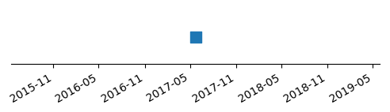

# moai
:moyai: Tracks changes to pharmaceutical product websites.

Moai /ˈmoʊ.aɪ/ provides competitive intelligence by tracking the unique regulatory code on pharmaceutical websites that are mandated by the FDA. This provides insight as to when, and how often, a website is updated.

### [4ventavis.com](4ventavis.com)
| Name | Class | Indication(s) | |
| -- | -- | -- | -- |
| Iloprost | prostacyclin analog | ['pulmonary arterial hypertension'] |  |

### [opsumit.com](opsumit.com)
| Name | Class | Indication(s) | |
| -- | -- | -- | -- |
| Macitentan | endothelin receptor antagonist | ['pulmonary arterial hypertension'] |  |

### [tracleer.com](tracleer.com)
| Name | Class | Indication(s) | |
| -- | -- | -- | -- |
| Bosentan | dual endothelin receptor antagonist | ['pulmonary arterial hypertension'] |  |

### [uptravi.com](uptravi.com)
| Name | Class | Indication(s) | |
| -- | -- | -- | -- |
| Selexipag | None | ['pulmonary arterial hypertension'] |  |

### [valchlor.com](valchlor.com)
| Name | Class | Indication(s) | |
| -- | -- | -- | -- |
| Mechlorethamine | alkylating antineoplastic agent | ['cutaneous T-cell lymphoma'] |  |

### [veletri.com](veletri.com)
| Name | Class | Indication(s) | |
| -- | -- | -- | -- |
| Epoprostenol | prostaglandin | ['pulmonary arterial hypertension'] |  |

### [zavesca.com](zavesca.com)
| Name | Class | Indication(s) | |
| -- | -- | -- | -- |
| Miglustat | enzyme inhibitors | ['type I Gaucher disease'] |  |
