# moai
:moyai: Pharmaceutical competitive intelligence through product website FDA OPDP update frequency.

Moai /ˈmoʊ.aɪ/ provides competitive intelligence by tracking the unique regulatory code on United States pharmaceutical websites that are mandated by the FDA. This provides insight as to when, and how often, a website is updated.

|  | Meet Charles, the moaiBOT. He scours websites daily, looking for changes. Charles likes fishing and long walks on the beach. |
| -- | -- |

Additionally, the following the metrics are captured:

* **Regulatory code**: Gain insight into how often a website is updated
* **HTTPS**: Sadly, many website infrastructures do not provide HTTPS which [provides no data security](https://www.chromium.org/Home/chromium-security/marking-http-as-non-secure) to its visitors
* :trophy: [MozRank](https://moz.com/learn/seo/mozrank) quantifies link popularity and is Moz’s version of Google’s classic PageRank algorithm
* :link: Moz total number of links (juice-passing or not, internal or external) of the final redirected url (http://drug.com > https://www.drug.com)
* :iphone: Google PageSpeed Insights mobile speed score
* :wheelchair: Google PageSpeed Insights mobile usability score
* :computer: Google PageSpeed Insights desktop speed score
* **server**: The HTTP server header provides insight into infrastructure changes
* **ASN**: Autonomous System Number provides insight into data center moves

Looking for a website and workflow management platform that delivers a competitive edge? Give [Catapult](https://github.com/devopsgroup-io/catapult) a *shot*.

The below data is free, looking for a complete picture with valuable insights? Please contact us at info@devopsgroup.io to learn more.
<table>
<tr><td colspan="11"><strong>Cancer - Brain Tumor</strong></td></tr>
<tr><td>Drug \ generic \ company \ FDA approval</td><td>Regulatory code </td><td>HTTPS </td><td>:trophy: </td><td>:link: </td><td>:iphone: </td><td>:wheelchair: </td><td>:computer: </td><td>Server </td><td>ASN </td><td>&nbsp;&nbsp;&nbsp;&nbsp;&nbsp;&nbsp;&nbsp;&nbsp;&nbsp;&nbsp;&nbsp;&nbsp;&nbsp;&nbsp;&nbsp;&nbsp;&nbsp;&nbsp;&nbsp;&nbsp;&nbsp;&nbsp;&nbsp;&nbsp;&nbsp;&nbsp;&nbsp;&nbsp;&nbsp;&nbsp;&nbsp;&nbsp;&nbsp;&nbsp;&nbsp;&nbsp;&nbsp;&nbsp;&nbsp;&nbsp;&nbsp;&nbsp;&nbsp;&nbsp;&nbsp;&nbsp;&nbsp;&nbsp;&nbsp;&nbsp;&nbsp;&nbsp;&nbsp;&nbsp;&nbsp;&nbsp;&nbsp;&nbsp;&nbsp;&nbsp;&nbsp;&nbsp;&nbsp;&nbsp;&nbsp;&nbsp;&nbsp;&nbsp;&nbsp;&nbsp;&nbsp;&nbsp;&nbsp;&nbsp;&nbsp;&nbsp;&nbsp;&nbsp;&nbsp;&nbsp;&nbsp;&nbsp;&nbsp;&nbsp;&nbsp;&nbsp;&nbsp;&nbsp;&nbsp;&nbsp;&nbsp;&nbsp;&nbsp;&nbsp;&nbsp;&nbsp;&nbsp;&nbsp;&nbsp;&nbsp;&nbsp;&nbsp;&nbsp;&nbsp;&nbsp;&nbsp;&nbsp;&nbsp;&nbsp;&nbsp;&nbsp;&nbsp;&nbsp;&nbsp;&nbsp;&nbsp;&nbsp;&nbsp;&nbsp;&nbsp;&nbsp;&nbsp;&nbsp;&nbsp;&nbsp;&nbsp;&nbsp;&nbsp;&nbsp;&nbsp;&nbsp;&nbsp;&nbsp;&nbsp;&nbsp;&nbsp;&nbsp;&nbsp;&nbsp;&nbsp;&nbsp;&nbsp;&nbsp;&nbsp;&nbsp;&nbsp;&nbsp;&nbsp;&nbsp;&nbsp;&nbsp;&nbsp;&nbsp;&nbsp;&nbsp;&nbsp;&nbsp;&nbsp;&nbsp;&nbsp;&nbsp;&nbsp;&nbsp;&nbsp;&nbsp;&nbsp;&nbsp;&nbsp;&nbsp;&nbsp;&nbsp;&nbsp;&nbsp;&nbsp;&nbsp;&nbsp;&nbsp;&nbsp;&nbsp;&nbsp;&nbsp;&nbsp;&nbsp;&nbsp;&nbsp;&nbsp;&nbsp;&nbsp;&nbsp;&nbsp;&nbsp;&nbsp;&nbsp;&nbsp;&nbsp;&nbsp;&nbsp;&nbsp;&nbsp;&nbsp;&nbsp;&nbsp;&nbsp;&nbsp;&nbsp;&nbsp;&nbsp;&nbsp;&nbsp;&nbsp;&nbsp;</td></tr>
<tr><td><a href="http://gliadel.com/patient" target="_blank">gliadel.com/patient</a>   carmustine systemic   Arbor   09/23/1996</td><td>GL076.001 </td><td><a href="https://www.ssllabs.com/ssltest/analyze.html?d=gliadel.com/patient" target="_blank">:x:</a></td><td>0</td><td>0</td><td><a href="https://developers.google.com/speed/pagespeed/insights/?url=gliadel.com/patient&tab=mobile" target="_blank">72</a></td><td><a href="https://developers.google.com/speed/pagespeed/insights/?url=gliadel.com/patient&tab=mobile" target="_blank">99</a></td><td><a href="https://developers.google.com/speed/pagespeed/insights/?url=gliadel.com/patient&tab=desktop" target="_blank">83</a></td><td>Apache</td><td>AS22915 FutureQuest, Inc.</td><td>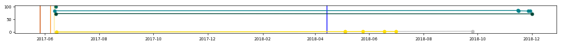</td></tr>
<tr><td><a href="http://us.afinitor.com/sega-tuberous-sclerosis" target="_blank">us.afinitor.com/sega-tuberous-sclerosis</a>   everolimus systemic   Novartis   03/30/2009</td><td>AFT-1142638 </td><td><a href="https://www.ssllabs.com/ssltest/analyze.html?d=us.afinitor.com/sega-tuberous-sclerosis" target="_blank">:white_check_mark:</a></td><td>0</td><td>0</td><td><a href="https://developers.google.com/speed/pagespeed/insights/?url=us.afinitor.com/sega-tuberous-sclerosis&tab=mobile" target="_blank">56</a></td><td><a href="https://developers.google.com/speed/pagespeed/insights/?url=us.afinitor.com/sega-tuberous-sclerosis&tab=mobile" target="_blank">99</a></td><td><a href="https://developers.google.com/speed/pagespeed/insights/?url=us.afinitor.com/sega-tuberous-sclerosis&tab=desktop" target="_blank">66</a></td><td>ECAcc (nya/7976)</td><td>AS30811 EPiServer AB</td><td>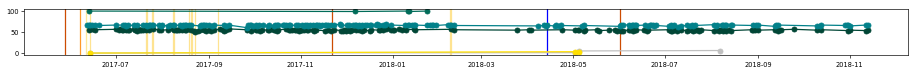</td></tr>
<tr><td colspan="11"><strong>Cancer - Colorectal Cancer</strong></td></tr>
<tr><td>Drug \ generic \ company \ FDA approval</td><td>Regulatory code </td><td>HTTPS </td><td>:trophy: </td><td>:link: </td><td>:iphone: </td><td>:wheelchair: </td><td>:computer: </td><td>Server </td><td>ASN </td><td>&nbsp;&nbsp;&nbsp;&nbsp;&nbsp;&nbsp;&nbsp;&nbsp;&nbsp;&nbsp;&nbsp;&nbsp;&nbsp;&nbsp;&nbsp;&nbsp;&nbsp;&nbsp;&nbsp;&nbsp;&nbsp;&nbsp;&nbsp;&nbsp;&nbsp;&nbsp;&nbsp;&nbsp;&nbsp;&nbsp;&nbsp;&nbsp;&nbsp;&nbsp;&nbsp;&nbsp;&nbsp;&nbsp;&nbsp;&nbsp;&nbsp;&nbsp;&nbsp;&nbsp;&nbsp;&nbsp;&nbsp;&nbsp;&nbsp;&nbsp;&nbsp;&nbsp;&nbsp;&nbsp;&nbsp;&nbsp;&nbsp;&nbsp;&nbsp;&nbsp;&nbsp;&nbsp;&nbsp;&nbsp;&nbsp;&nbsp;&nbsp;&nbsp;&nbsp;&nbsp;&nbsp;&nbsp;&nbsp;&nbsp;&nbsp;&nbsp;&nbsp;&nbsp;&nbsp;&nbsp;&nbsp;&nbsp;&nbsp;&nbsp;&nbsp;&nbsp;&nbsp;&nbsp;&nbsp;&nbsp;&nbsp;&nbsp;&nbsp;&nbsp;&nbsp;&nbsp;&nbsp;&nbsp;&nbsp;&nbsp;&nbsp;&nbsp;&nbsp;&nbsp;&nbsp;&nbsp;&nbsp;&nbsp;&nbsp;&nbsp;&nbsp;&nbsp;&nbsp;&nbsp;&nbsp;&nbsp;&nbsp;&nbsp;&nbsp;&nbsp;&nbsp;&nbsp;&nbsp;&nbsp;&nbsp;&nbsp;&nbsp;&nbsp;&nbsp;&nbsp;&nbsp;&nbsp;&nbsp;&nbsp;&nbsp;&nbsp;&nbsp;&nbsp;&nbsp;&nbsp;&nbsp;&nbsp;&nbsp;&nbsp;&nbsp;&nbsp;&nbsp;&nbsp;&nbsp;&nbsp;&nbsp;&nbsp;&nbsp;&nbsp;&nbsp;&nbsp;&nbsp;&nbsp;&nbsp;&nbsp;&nbsp;&nbsp;&nbsp;&nbsp;&nbsp;&nbsp;&nbsp;&nbsp;&nbsp;&nbsp;&nbsp;&nbsp;&nbsp;&nbsp;&nbsp;&nbsp;&nbsp;&nbsp;&nbsp;&nbsp;&nbsp;&nbsp;&nbsp;&nbsp;&nbsp;&nbsp;&nbsp;&nbsp;&nbsp;&nbsp;&nbsp;&nbsp;&nbsp;&nbsp;&nbsp;&nbsp;&nbsp;&nbsp;&nbsp;&nbsp;&nbsp;&nbsp;&nbsp;&nbsp;&nbsp;&nbsp;&nbsp;&nbsp;&nbsp;&nbsp;&nbsp;</td></tr>
<tr><td><a href="http://erbitux.com" target="_blank">erbitux.com</a>   cetuximab systemic   Lilly   02/12/2004</td><td>PP-CE-US-0346 </td><td><a href="https://www.ssllabs.com/ssltest/analyze.html?d=erbitux.com" target="_blank">:x:</a></td><td>5.2</td><td>357</td><td><a href="https://developers.google.com/speed/pagespeed/insights/?url=erbitux.com&tab=mobile" target="_blank">74</a></td><td><a href="https://developers.google.com/speed/pagespeed/insights/?url=erbitux.com&tab=mobile" target="_blank">99</a></td><td><a href="https://developers.google.com/speed/pagespeed/insights/?url=erbitux.com&tab=desktop" target="_blank">82</a></td><td>Microsoft-IIS/7.5</td><td>AS14618 Amazon.com, Inc.</td><td>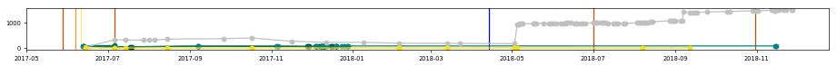</td></tr>
<tr><td><a href="http://stivarga-us.com" target="_blank">stivarga-us.com</a>   regorafenib systemic   Bayer   09/27/2012</td><td>06/2017 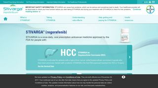</td><td><a href="https://www.ssllabs.com/ssltest/analyze.html?d=stivarga-us.com" target="_blank">:x:</a></td><td>5.0</td><td>98</td><td><a href="https://developers.google.com/speed/pagespeed/insights/?url=stivarga-us.com&tab=mobile" target="_blank">61</a></td><td><a href="https://developers.google.com/speed/pagespeed/insights/?url=stivarga-us.com&tab=mobile" target="_blank">99</a></td><td><a href="https://developers.google.com/speed/pagespeed/insights/?url=stivarga-us.com&tab=desktop" target="_blank">72</a></td><td>Apache</td><td>AS19574 Corporation Service Company</td><td>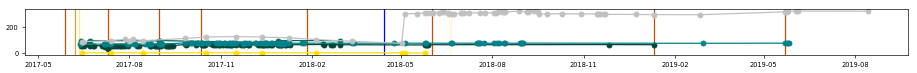</td></tr>
<tr><td><a href="http://zaltrap.com" target="_blank">zaltrap.com</a>   ziv-aflibercept systemic   Sanofi   08/03/2012</td><td>US.AFL.17.05.334 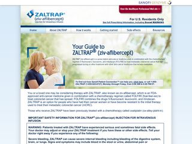</td><td><a href="https://www.ssllabs.com/ssltest/analyze.html?d=zaltrap.com" target="_blank">:x:</a></td><td>4.7</td><td>100</td><td><a href="https://developers.google.com/speed/pagespeed/insights/?url=zaltrap.com&tab=mobile" target="_blank">47</a></td><td><a href="https://developers.google.com/speed/pagespeed/insights/?url=zaltrap.com&tab=mobile" target="_blank">100</a></td><td><a href="https://developers.google.com/speed/pagespeed/insights/?url=zaltrap.com&tab=desktop" target="_blank">61</a></td><td>Microsoft-IIS/7.5</td><td>AS17338 AOScloud, LLC.</td><td>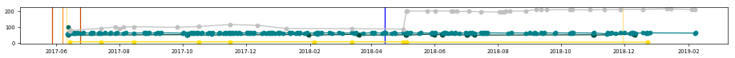</td></tr>
<tr><td colspan="11"><strong>Cancer - Gastric Cancer</strong></td></tr>
<tr><td>Drug \ generic \ company \ FDA approval</td><td>Regulatory code </td><td>HTTPS </td><td>:trophy: </td><td>:link: </td><td>:iphone: </td><td>:wheelchair: </td><td>:computer: </td><td>Server </td><td>ASN </td><td>&nbsp;&nbsp;&nbsp;&nbsp;&nbsp;&nbsp;&nbsp;&nbsp;&nbsp;&nbsp;&nbsp;&nbsp;&nbsp;&nbsp;&nbsp;&nbsp;&nbsp;&nbsp;&nbsp;&nbsp;&nbsp;&nbsp;&nbsp;&nbsp;&nbsp;&nbsp;&nbsp;&nbsp;&nbsp;&nbsp;&nbsp;&nbsp;&nbsp;&nbsp;&nbsp;&nbsp;&nbsp;&nbsp;&nbsp;&nbsp;&nbsp;&nbsp;&nbsp;&nbsp;&nbsp;&nbsp;&nbsp;&nbsp;&nbsp;&nbsp;&nbsp;&nbsp;&nbsp;&nbsp;&nbsp;&nbsp;&nbsp;&nbsp;&nbsp;&nbsp;&nbsp;&nbsp;&nbsp;&nbsp;&nbsp;&nbsp;&nbsp;&nbsp;&nbsp;&nbsp;&nbsp;&nbsp;&nbsp;&nbsp;&nbsp;&nbsp;&nbsp;&nbsp;&nbsp;&nbsp;&nbsp;&nbsp;&nbsp;&nbsp;&nbsp;&nbsp;&nbsp;&nbsp;&nbsp;&nbsp;&nbsp;&nbsp;&nbsp;&nbsp;&nbsp;&nbsp;&nbsp;&nbsp;&nbsp;&nbsp;&nbsp;&nbsp;&nbsp;&nbsp;&nbsp;&nbsp;&nbsp;&nbsp;&nbsp;&nbsp;&nbsp;&nbsp;&nbsp;&nbsp;&nbsp;&nbsp;&nbsp;&nbsp;&nbsp;&nbsp;&nbsp;&nbsp;&nbsp;&nbsp;&nbsp;&nbsp;&nbsp;&nbsp;&nbsp;&nbsp;&nbsp;&nbsp;&nbsp;&nbsp;&nbsp;&nbsp;&nbsp;&nbsp;&nbsp;&nbsp;&nbsp;&nbsp;&nbsp;&nbsp;&nbsp;&nbsp;&nbsp;&nbsp;&nbsp;&nbsp;&nbsp;&nbsp;&nbsp;&nbsp;&nbsp;&nbsp;&nbsp;&nbsp;&nbsp;&nbsp;&nbsp;&nbsp;&nbsp;&nbsp;&nbsp;&nbsp;&nbsp;&nbsp;&nbsp;&nbsp;&nbsp;&nbsp;&nbsp;&nbsp;&nbsp;&nbsp;&nbsp;&nbsp;&nbsp;&nbsp;&nbsp;&nbsp;&nbsp;&nbsp;&nbsp;&nbsp;&nbsp;&nbsp;&nbsp;&nbsp;&nbsp;&nbsp;&nbsp;&nbsp;&nbsp;&nbsp;&nbsp;&nbsp;&nbsp;&nbsp;&nbsp;&nbsp;&nbsp;&nbsp;&nbsp;&nbsp;&nbsp;&nbsp;&nbsp;&nbsp;&nbsp;</td></tr>
<tr><td><a href="http://cyramza.com" target="_blank">cyramza.com</a>   ramucirumab systemic   Lilly   04/21/2014</td><td>RB-P CON ISI 02NOV2015 </td><td><a href="https://www.ssllabs.com/ssltest/analyze.html?d=cyramza.com" target="_blank">:x:</a></td><td>5.5</td><td>363</td><td><a href="https://developers.google.com/speed/pagespeed/insights/?url=cyramza.com&tab=mobile" target="_blank">64</a></td><td><a href="https://developers.google.com/speed/pagespeed/insights/?url=cyramza.com&tab=mobile" target="_blank">90</a></td><td><a href="https://developers.google.com/speed/pagespeed/insights/?url=cyramza.com&tab=desktop" target="_blank">75</a></td><td>Microsoft-IIS/7.5</td><td>AS14618 Amazon.com, Inc.</td><td>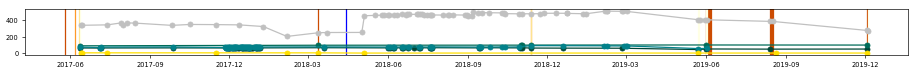</td></tr>
<tr><td colspan="11"><strong>Cancer - Ovarian Cancer</strong></td></tr>
<tr><td>Drug \ generic \ company \ FDA approval</td><td>Regulatory code </td><td>HTTPS </td><td>:trophy: </td><td>:link: </td><td>:iphone: </td><td>:wheelchair: </td><td>:computer: </td><td>Server </td><td>ASN </td><td>&nbsp;&nbsp;&nbsp;&nbsp;&nbsp;&nbsp;&nbsp;&nbsp;&nbsp;&nbsp;&nbsp;&nbsp;&nbsp;&nbsp;&nbsp;&nbsp;&nbsp;&nbsp;&nbsp;&nbsp;&nbsp;&nbsp;&nbsp;&nbsp;&nbsp;&nbsp;&nbsp;&nbsp;&nbsp;&nbsp;&nbsp;&nbsp;&nbsp;&nbsp;&nbsp;&nbsp;&nbsp;&nbsp;&nbsp;&nbsp;&nbsp;&nbsp;&nbsp;&nbsp;&nbsp;&nbsp;&nbsp;&nbsp;&nbsp;&nbsp;&nbsp;&nbsp;&nbsp;&nbsp;&nbsp;&nbsp;&nbsp;&nbsp;&nbsp;&nbsp;&nbsp;&nbsp;&nbsp;&nbsp;&nbsp;&nbsp;&nbsp;&nbsp;&nbsp;&nbsp;&nbsp;&nbsp;&nbsp;&nbsp;&nbsp;&nbsp;&nbsp;&nbsp;&nbsp;&nbsp;&nbsp;&nbsp;&nbsp;&nbsp;&nbsp;&nbsp;&nbsp;&nbsp;&nbsp;&nbsp;&nbsp;&nbsp;&nbsp;&nbsp;&nbsp;&nbsp;&nbsp;&nbsp;&nbsp;&nbsp;&nbsp;&nbsp;&nbsp;&nbsp;&nbsp;&nbsp;&nbsp;&nbsp;&nbsp;&nbsp;&nbsp;&nbsp;&nbsp;&nbsp;&nbsp;&nbsp;&nbsp;&nbsp;&nbsp;&nbsp;&nbsp;&nbsp;&nbsp;&nbsp;&nbsp;&nbsp;&nbsp;&nbsp;&nbsp;&nbsp;&nbsp;&nbsp;&nbsp;&nbsp;&nbsp;&nbsp;&nbsp;&nbsp;&nbsp;&nbsp;&nbsp;&nbsp;&nbsp;&nbsp;&nbsp;&nbsp;&nbsp;&nbsp;&nbsp;&nbsp;&nbsp;&nbsp;&nbsp;&nbsp;&nbsp;&nbsp;&nbsp;&nbsp;&nbsp;&nbsp;&nbsp;&nbsp;&nbsp;&nbsp;&nbsp;&nbsp;&nbsp;&nbsp;&nbsp;&nbsp;&nbsp;&nbsp;&nbsp;&nbsp;&nbsp;&nbsp;&nbsp;&nbsp;&nbsp;&nbsp;&nbsp;&nbsp;&nbsp;&nbsp;&nbsp;&nbsp;&nbsp;&nbsp;&nbsp;&nbsp;&nbsp;&nbsp;&nbsp;&nbsp;&nbsp;&nbsp;&nbsp;&nbsp;&nbsp;&nbsp;&nbsp;&nbsp;&nbsp;&nbsp;&nbsp;&nbsp;&nbsp;&nbsp;&nbsp;&nbsp;&nbsp;</td></tr>
<tr><td><a href="http://www.doxil.com/ovarian-cancer" target="_blank">www.doxil.com/ovarian-cancer</a>   doxorubicin liposomal systemic   Janssen   11/17/1995</td><td>030068-150417 </td><td><a href="https://www.ssllabs.com/ssltest/analyze.html?d=www.doxil.com/ovarian-cancer" target="_blank">:white_check_mark:</a></td><td>4.9</td><td>14</td><td><a href="https://developers.google.com/speed/pagespeed/insights/?url=www.doxil.com/ovarian-cancer&tab=mobile" target="_blank">69</a></td><td><a href="https://developers.google.com/speed/pagespeed/insights/?url=www.doxil.com/ovarian-cancer&tab=mobile" target="_blank">68</a></td><td><a href="https://developers.google.com/speed/pagespeed/insights/?url=www.doxil.com/ovarian-cancer&tab=desktop" target="_blank">83</a></td><td>nginx</td><td>AS14618 Amazon.com, Inc.</td><td>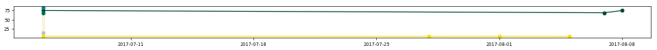</td></tr>
<tr><td><a href="http://ethyol.com/usa" target="_blank">ethyol.com/usa</a>   amifostine systemic   Cumberland Pharmaceuticals   12/08/1995</td><td>WWW2210617 </td><td><a href="https://www.ssllabs.com/ssltest/analyze.html?d=ethyol.com/usa" target="_blank">:x:</a></td><td>3.5</td><td>3</td><td><a href="https://developers.google.com/speed/pagespeed/insights/?url=ethyol.com/usa&tab=mobile" target="_blank">47</a></td><td><a href="https://developers.google.com/speed/pagespeed/insights/?url=ethyol.com/usa&tab=mobile" target="_blank">96</a></td><td><a href="https://developers.google.com/speed/pagespeed/insights/?url=ethyol.com/usa&tab=desktop" target="_blank">56</a></td><td>Apache/2.4</td><td>AS32244 Liquid Web, L.L.C</td><td>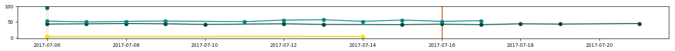</td></tr>
<tr><td><a href="http://lynparza.com" target="_blank">lynparza.com</a>   olaparib systemic   AstraZeneca   12/19/2014</td><td>DA-1088 </td><td><a href="https://www.ssllabs.com/ssltest/analyze.html?d=lynparza.com" target="_blank">:white_check_mark:</a></td><td>6.1</td><td>45</td><td><a href="https://developers.google.com/speed/pagespeed/insights/?url=lynparza.com&tab=mobile" target="_blank">56</a></td><td><a href="https://developers.google.com/speed/pagespeed/insights/?url=lynparza.com&tab=mobile" target="_blank">98</a></td><td><a href="https://developers.google.com/speed/pagespeed/insights/?url=lynparza.com&tab=desktop" target="_blank">75</a></td><td>Apache</td><td>AS16509 Amazon.com, Inc.</td><td>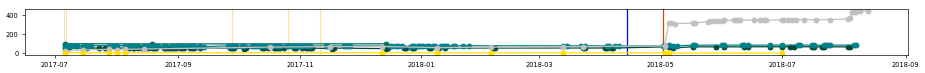</td></tr>
<tr><td><a href="http://rubraca.com" target="_blank">rubraca.com</a>   rucaparib systemic   Clovis Oncology   12/19/2016</td><td>PP-RUCA-US-0350 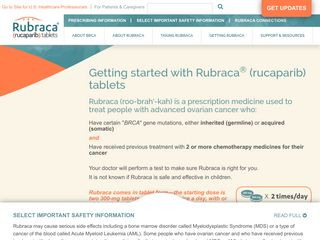</td><td><a href="https://www.ssllabs.com/ssltest/analyze.html?d=rubraca.com" target="_blank">:x:</a></td><td>0</td><td>0</td><td><a href="https://developers.google.com/speed/pagespeed/insights/?url=rubraca.com&tab=mobile" target="_blank">27</a></td><td><a href="https://developers.google.com/speed/pagespeed/insights/?url=rubraca.com&tab=mobile" target="_blank">99</a></td><td><a href="https://developers.google.com/speed/pagespeed/insights/?url=rubraca.com&tab=desktop" target="_blank">32</a></td><td>Apache/2.2.15 (Red Hat) DAV/2 mod_ssl/2.2.15 OpenSSL/1.0.1e-fips</td><td>AS33070 Rackspace Ltd.</td><td>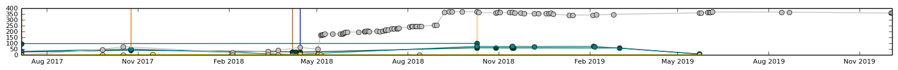</td></tr>
<tr><td><a href="http://zejula.com" target="_blank">zejula.com</a>   niraparib systemic   Tesaro   03/27/2017</td><td>PP-ZEJ-US-0086 </td><td><a href="https://www.ssllabs.com/ssltest/analyze.html?d=zejula.com" target="_blank">:x:</a></td><td>4.9</td><td>95</td><td><a href="https://developers.google.com/speed/pagespeed/insights/?url=zejula.com&tab=mobile" target="_blank">66</a></td><td><a href="https://developers.google.com/speed/pagespeed/insights/?url=zejula.com&tab=mobile" target="_blank">100</a></td><td><a href="https://developers.google.com/speed/pagespeed/insights/?url=zejula.com&tab=desktop" target="_blank">76</a></td><td>Apache</td><td>AS26347 New Dream Network, LLC</td><td>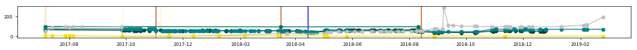</td></tr>
<tr><td colspan="11"><strong>Cardiovascular Conditions and Disorders - High Cholesterol</strong></td></tr>
<tr><td>Drug \ generic \ company \ FDA approval</td><td>Regulatory code </td><td>HTTPS </td><td>:trophy: </td><td>:link: </td><td>:iphone: </td><td>:wheelchair: </td><td>:computer: </td><td>Server </td><td>ASN </td><td>&nbsp;&nbsp;&nbsp;&nbsp;&nbsp;&nbsp;&nbsp;&nbsp;&nbsp;&nbsp;&nbsp;&nbsp;&nbsp;&nbsp;&nbsp;&nbsp;&nbsp;&nbsp;&nbsp;&nbsp;&nbsp;&nbsp;&nbsp;&nbsp;&nbsp;&nbsp;&nbsp;&nbsp;&nbsp;&nbsp;&nbsp;&nbsp;&nbsp;&nbsp;&nbsp;&nbsp;&nbsp;&nbsp;&nbsp;&nbsp;&nbsp;&nbsp;&nbsp;&nbsp;&nbsp;&nbsp;&nbsp;&nbsp;&nbsp;&nbsp;&nbsp;&nbsp;&nbsp;&nbsp;&nbsp;&nbsp;&nbsp;&nbsp;&nbsp;&nbsp;&nbsp;&nbsp;&nbsp;&nbsp;&nbsp;&nbsp;&nbsp;&nbsp;&nbsp;&nbsp;&nbsp;&nbsp;&nbsp;&nbsp;&nbsp;&nbsp;&nbsp;&nbsp;&nbsp;&nbsp;&nbsp;&nbsp;&nbsp;&nbsp;&nbsp;&nbsp;&nbsp;&nbsp;&nbsp;&nbsp;&nbsp;&nbsp;&nbsp;&nbsp;&nbsp;&nbsp;&nbsp;&nbsp;&nbsp;&nbsp;&nbsp;&nbsp;&nbsp;&nbsp;&nbsp;&nbsp;&nbsp;&nbsp;&nbsp;&nbsp;&nbsp;&nbsp;&nbsp;&nbsp;&nbsp;&nbsp;&nbsp;&nbsp;&nbsp;&nbsp;&nbsp;&nbsp;&nbsp;&nbsp;&nbsp;&nbsp;&nbsp;&nbsp;&nbsp;&nbsp;&nbsp;&nbsp;&nbsp;&nbsp;&nbsp;&nbsp;&nbsp;&nbsp;&nbsp;&nbsp;&nbsp;&nbsp;&nbsp;&nbsp;&nbsp;&nbsp;&nbsp;&nbsp;&nbsp;&nbsp;&nbsp;&nbsp;&nbsp;&nbsp;&nbsp;&nbsp;&nbsp;&nbsp;&nbsp;&nbsp;&nbsp;&nbsp;&nbsp;&nbsp;&nbsp;&nbsp;&nbsp;&nbsp;&nbsp;&nbsp;&nbsp;&nbsp;&nbsp;&nbsp;&nbsp;&nbsp;&nbsp;&nbsp;&nbsp;&nbsp;&nbsp;&nbsp;&nbsp;&nbsp;&nbsp;&nbsp;&nbsp;&nbsp;&nbsp;&nbsp;&nbsp;&nbsp;&nbsp;&nbsp;&nbsp;&nbsp;&nbsp;&nbsp;&nbsp;&nbsp;&nbsp;&nbsp;&nbsp;&nbsp;&nbsp;&nbsp;&nbsp;&nbsp;&nbsp;&nbsp;&nbsp;</td></tr>
<tr><td><a href="http://crestor.com" target="_blank">crestor.com</a>   rosuvastatin systemic   AstraZeneca   08/12/2003</td><td>1929508-3158916 </td><td><a href="https://www.ssllabs.com/ssltest/analyze.html?d=crestor.com" target="_blank">:white_check_mark:</a></td><td>6.8</td><td>347</td><td><a href="https://developers.google.com/speed/pagespeed/insights/?url=crestor.com&tab=mobile" target="_blank">68</a></td><td><a href="https://developers.google.com/speed/pagespeed/insights/?url=crestor.com&tab=mobile" target="_blank">93</a></td><td><a href="https://developers.google.com/speed/pagespeed/insights/?url=crestor.com&tab=desktop" target="_blank">84</a></td><td>Apache</td><td>AS16509 Amazon.com, Inc.</td><td>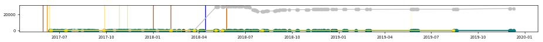</td></tr>
<tr><td><a href="http://lipitor.com" target="_blank">lipitor.com</a>   atorvastatin systemic   Pfizer   12/17/1996</td><td>PP-LIP-USA-0252 </td><td><a href="https://www.ssllabs.com/ssltest/analyze.html?d=lipitor.com" target="_blank">:white_check_mark:</a></td><td>5.3</td><td>737</td><td><a href="https://developers.google.com/speed/pagespeed/insights/?url=lipitor.com&tab=mobile" target="_blank">59</a></td><td><a href="https://developers.google.com/speed/pagespeed/insights/?url=lipitor.com&tab=mobile" target="_blank">100</a></td><td><a href="https://developers.google.com/speed/pagespeed/insights/?url=lipitor.com&tab=desktop" target="_blank">77</a></td><td>cloudflare-nginx</td><td>AS13335 Cloudflare Inc</td><td>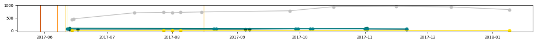</td></tr>
<tr><td><a href="http://livalorx.com" target="_blank">livalorx.com</a>   pitavastatin systemic   Kowa   08/03/2009</td><td>LIV-MT-2338 </td><td><a href="https://www.ssllabs.com/ssltest/analyze.html?d=livalorx.com" target="_blank">:white_check_mark:</a></td><td>5.0</td><td>53</td><td><a href="https://developers.google.com/speed/pagespeed/insights/?url=livalorx.com&tab=mobile" target="_blank">56</a></td><td><a href="https://developers.google.com/speed/pagespeed/insights/?url=livalorx.com&tab=mobile" target="_blank">98</a></td><td><a href="https://developers.google.com/speed/pagespeed/insights/?url=livalorx.com&tab=desktop" target="_blank">74</a></td><td>Microsoft-IIS/8.0</td><td>AS32244 Liquid Web, L.L.C</td><td>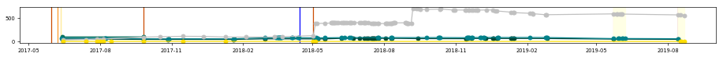</td></tr>
<tr><td><a href="http://repatha.com" target="_blank">repatha.com</a>   evolocumab systemic   Amgen   08/27/2015</td><td>USA-145-107362 </td><td><a href="https://www.ssllabs.com/ssltest/analyze.html?d=repatha.com" target="_blank">:white_check_mark:</a></td><td>4.6</td><td>553</td><td><a href="https://developers.google.com/speed/pagespeed/insights/?url=repatha.com&tab=mobile" target="_blank">62</a></td><td><a href="https://developers.google.com/speed/pagespeed/insights/?url=repatha.com&tab=mobile" target="_blank">100</a></td><td><a href="https://developers.google.com/speed/pagespeed/insights/?url=repatha.com&tab=desktop" target="_blank">63</a></td><td>Microsoft-IIS/7.5</td><td>AS3561 Savvis</td><td>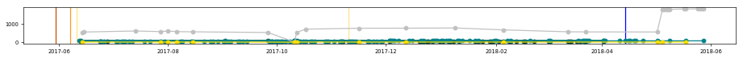</td></tr>
<tr><td colspan="11"><strong>Central Nervous System Disorders - Alzheimer's Disease</strong></td></tr>
<tr><td>Drug \ generic \ company \ FDA approval</td><td>Regulatory code </td><td>HTTPS </td><td>:trophy: </td><td>:link: </td><td>:iphone: </td><td>:wheelchair: </td><td>:computer: </td><td>Server </td><td>ASN </td><td>&nbsp;&nbsp;&nbsp;&nbsp;&nbsp;&nbsp;&nbsp;&nbsp;&nbsp;&nbsp;&nbsp;&nbsp;&nbsp;&nbsp;&nbsp;&nbsp;&nbsp;&nbsp;&nbsp;&nbsp;&nbsp;&nbsp;&nbsp;&nbsp;&nbsp;&nbsp;&nbsp;&nbsp;&nbsp;&nbsp;&nbsp;&nbsp;&nbsp;&nbsp;&nbsp;&nbsp;&nbsp;&nbsp;&nbsp;&nbsp;&nbsp;&nbsp;&nbsp;&nbsp;&nbsp;&nbsp;&nbsp;&nbsp;&nbsp;&nbsp;&nbsp;&nbsp;&nbsp;&nbsp;&nbsp;&nbsp;&nbsp;&nbsp;&nbsp;&nbsp;&nbsp;&nbsp;&nbsp;&nbsp;&nbsp;&nbsp;&nbsp;&nbsp;&nbsp;&nbsp;&nbsp;&nbsp;&nbsp;&nbsp;&nbsp;&nbsp;&nbsp;&nbsp;&nbsp;&nbsp;&nbsp;&nbsp;&nbsp;&nbsp;&nbsp;&nbsp;&nbsp;&nbsp;&nbsp;&nbsp;&nbsp;&nbsp;&nbsp;&nbsp;&nbsp;&nbsp;&nbsp;&nbsp;&nbsp;&nbsp;&nbsp;&nbsp;&nbsp;&nbsp;&nbsp;&nbsp;&nbsp;&nbsp;&nbsp;&nbsp;&nbsp;&nbsp;&nbsp;&nbsp;&nbsp;&nbsp;&nbsp;&nbsp;&nbsp;&nbsp;&nbsp;&nbsp;&nbsp;&nbsp;&nbsp;&nbsp;&nbsp;&nbsp;&nbsp;&nbsp;&nbsp;&nbsp;&nbsp;&nbsp;&nbsp;&nbsp;&nbsp;&nbsp;&nbsp;&nbsp;&nbsp;&nbsp;&nbsp;&nbsp;&nbsp;&nbsp;&nbsp;&nbsp;&nbsp;&nbsp;&nbsp;&nbsp;&nbsp;&nbsp;&nbsp;&nbsp;&nbsp;&nbsp;&nbsp;&nbsp;&nbsp;&nbsp;&nbsp;&nbsp;&nbsp;&nbsp;&nbsp;&nbsp;&nbsp;&nbsp;&nbsp;&nbsp;&nbsp;&nbsp;&nbsp;&nbsp;&nbsp;&nbsp;&nbsp;&nbsp;&nbsp;&nbsp;&nbsp;&nbsp;&nbsp;&nbsp;&nbsp;&nbsp;&nbsp;&nbsp;&nbsp;&nbsp;&nbsp;&nbsp;&nbsp;&nbsp;&nbsp;&nbsp;&nbsp;&nbsp;&nbsp;&nbsp;&nbsp;&nbsp;&nbsp;&nbsp;&nbsp;&nbsp;&nbsp;&nbsp;&nbsp;</td></tr>
<tr><td><a href="http://exelonpatch.com" target="_blank">exelonpatch.com</a>   rivastigmine systemic   Novartis   04/21/2000</td><td>T-EXP-1318386 </td><td><a href="https://www.ssllabs.com/ssltest/analyze.html?d=exelonpatch.com" target="_blank">:white_check_mark:</a></td><td>5.6</td><td>540</td><td><a href="https://developers.google.com/speed/pagespeed/insights/?url=exelonpatch.com&tab=mobile" target="_blank">41</a></td><td><a href="https://developers.google.com/speed/pagespeed/insights/?url=exelonpatch.com&tab=mobile" target="_blank">95</a></td><td><a href="https://developers.google.com/speed/pagespeed/insights/?url=exelonpatch.com&tab=desktop" target="_blank">58</a></td><td>WS</td><td>AS3707 MCI Communications Services, Inc. d/b/a Verizon Business</td><td>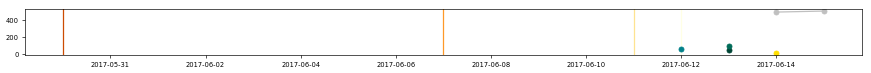</td></tr>
<tr><td><a href="http://namenda.com" target="_blank">namenda.com</a>   memantine systemic   Allergan   06/21/2010</td><td>NAM51044 </td><td><a href="https://www.ssllabs.com/ssltest/analyze.html?d=namenda.com" target="_blank">:x:</a></td><td>4.9</td><td>242</td><td><a href="https://developers.google.com/speed/pagespeed/insights/?url=namenda.com&tab=mobile" target="_blank">55</a></td><td><a href="https://developers.google.com/speed/pagespeed/insights/?url=namenda.com&tab=mobile" target="_blank">79</a></td><td><a href="https://developers.google.com/speed/pagespeed/insights/?url=namenda.com&tab=desktop" target="_blank">62</a></td><td>Microsoft-IIS/8.5</td><td>AS16509 Amazon.com, Inc.</td><td>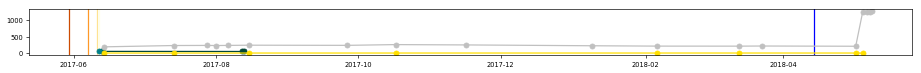</td></tr>
<tr><td><a href="http://namzaric.com" target="_blank">namzaric.com</a>   donepezil / memantine systemic   Allergan   12/23/2014</td><td>NMZ10684 </td><td><a href="https://www.ssllabs.com/ssltest/analyze.html?d=namzaric.com" target="_blank">:x:</a></td><td>5.1</td><td>149</td><td><a href="https://developers.google.com/speed/pagespeed/insights/?url=namzaric.com&tab=mobile" target="_blank">52</a></td><td><a href="https://developers.google.com/speed/pagespeed/insights/?url=namzaric.com&tab=mobile" target="_blank">100</a></td><td><a href="https://developers.google.com/speed/pagespeed/insights/?url=namzaric.com&tab=desktop" target="_blank">54</a></td><td>Microsoft-IIS/8.5</td><td>AS16509 Amazon.com, Inc.</td><td>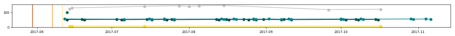</td></tr>
<tr><td colspan="11"><strong>Central Nervous System Disorders - Parkinson's Disease</strong></td></tr>
<tr><td>Drug \ generic \ company \ FDA approval</td><td>Regulatory code </td><td>HTTPS </td><td>:trophy: </td><td>:link: </td><td>:iphone: </td><td>:wheelchair: </td><td>:computer: </td><td>Server </td><td>ASN </td><td>&nbsp;&nbsp;&nbsp;&nbsp;&nbsp;&nbsp;&nbsp;&nbsp;&nbsp;&nbsp;&nbsp;&nbsp;&nbsp;&nbsp;&nbsp;&nbsp;&nbsp;&nbsp;&nbsp;&nbsp;&nbsp;&nbsp;&nbsp;&nbsp;&nbsp;&nbsp;&nbsp;&nbsp;&nbsp;&nbsp;&nbsp;&nbsp;&nbsp;&nbsp;&nbsp;&nbsp;&nbsp;&nbsp;&nbsp;&nbsp;&nbsp;&nbsp;&nbsp;&nbsp;&nbsp;&nbsp;&nbsp;&nbsp;&nbsp;&nbsp;&nbsp;&nbsp;&nbsp;&nbsp;&nbsp;&nbsp;&nbsp;&nbsp;&nbsp;&nbsp;&nbsp;&nbsp;&nbsp;&nbsp;&nbsp;&nbsp;&nbsp;&nbsp;&nbsp;&nbsp;&nbsp;&nbsp;&nbsp;&nbsp;&nbsp;&nbsp;&nbsp;&nbsp;&nbsp;&nbsp;&nbsp;&nbsp;&nbsp;&nbsp;&nbsp;&nbsp;&nbsp;&nbsp;&nbsp;&nbsp;&nbsp;&nbsp;&nbsp;&nbsp;&nbsp;&nbsp;&nbsp;&nbsp;&nbsp;&nbsp;&nbsp;&nbsp;&nbsp;&nbsp;&nbsp;&nbsp;&nbsp;&nbsp;&nbsp;&nbsp;&nbsp;&nbsp;&nbsp;&nbsp;&nbsp;&nbsp;&nbsp;&nbsp;&nbsp;&nbsp;&nbsp;&nbsp;&nbsp;&nbsp;&nbsp;&nbsp;&nbsp;&nbsp;&nbsp;&nbsp;&nbsp;&nbsp;&nbsp;&nbsp;&nbsp;&nbsp;&nbsp;&nbsp;&nbsp;&nbsp;&nbsp;&nbsp;&nbsp;&nbsp;&nbsp;&nbsp;&nbsp;&nbsp;&nbsp;&nbsp;&nbsp;&nbsp;&nbsp;&nbsp;&nbsp;&nbsp;&nbsp;&nbsp;&nbsp;&nbsp;&nbsp;&nbsp;&nbsp;&nbsp;&nbsp;&nbsp;&nbsp;&nbsp;&nbsp;&nbsp;&nbsp;&nbsp;&nbsp;&nbsp;&nbsp;&nbsp;&nbsp;&nbsp;&nbsp;&nbsp;&nbsp;&nbsp;&nbsp;&nbsp;&nbsp;&nbsp;&nbsp;&nbsp;&nbsp;&nbsp;&nbsp;&nbsp;&nbsp;&nbsp;&nbsp;&nbsp;&nbsp;&nbsp;&nbsp;&nbsp;&nbsp;&nbsp;&nbsp;&nbsp;&nbsp;&nbsp;&nbsp;&nbsp;&nbsp;&nbsp;&nbsp;</td></tr>
<tr><td><a href="http://azilect.com" target="_blank">azilect.com</a>   rasagiline systemic   Teva   05/16/2006</td><td>AZI-41439 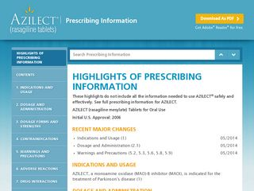</td><td><a href="https://www.ssllabs.com/ssltest/analyze.html?d=azilect.com" target="_blank">:white_check_mark:</a></td><td>5.2</td><td>35</td><td><a href="https://developers.google.com/speed/pagespeed/insights/?url=azilect.com&tab=mobile" target="_blank">56</a></td><td><a href="https://developers.google.com/speed/pagespeed/insights/?url=azilect.com&tab=mobile" target="_blank">99</a></td><td><a href="https://developers.google.com/speed/pagespeed/insights/?url=azilect.com&tab=desktop" target="_blank">65</a></td><td>Microsoft-IIS/8.5</td><td>AS17338 AOScloud, LLC.</td><td>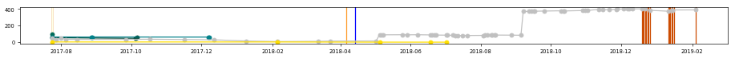</td></tr>
<tr><td><a href="http://mirapexer.com" target="_blank">mirapexer.com</a>   pramipexole systemic   Boehringer Ingelheim   05/16/2006</td><td>PC-MXP-0004 </td><td><a href="https://www.ssllabs.com/ssltest/analyze.html?d=mirapexer.com" target="_blank">:white_check_mark:</a></td><td>4.6</td><td>21</td><td><a href="https://developers.google.com/speed/pagespeed/insights/?url=mirapexer.com&tab=mobile" target="_blank">59</a></td><td><a href="https://developers.google.com/speed/pagespeed/insights/?url=mirapexer.com&tab=mobile" target="_blank">64</a></td><td><a href="https://developers.google.com/speed/pagespeed/insights/?url=mirapexer.com&tab=desktop" target="_blank">74</a></td><td>Apache/2.2.3 (Red Hat)</td><td>AS14492 DataPipe, Inc.</td><td>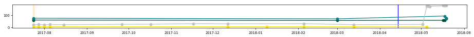</td></tr>
<tr><td><a href="http://rytary.com" target="_blank">rytary.com</a>   carbidopa / levodopa systemic   Impax   07/01/2015</td><td>PP-RYT-US-0066 </td><td><a href="https://www.ssllabs.com/ssltest/analyze.html?d=rytary.com" target="_blank">:white_check_mark:</a></td><td>6.1</td><td>39</td><td><a href="https://developers.google.com/speed/pagespeed/insights/?url=rytary.com&tab=mobile" target="_blank">57</a></td><td><a href="https://developers.google.com/speed/pagespeed/insights/?url=rytary.com&tab=mobile" target="_blank">100</a></td><td><a href="https://developers.google.com/speed/pagespeed/insights/?url=rytary.com&tab=desktop" target="_blank">74</a></td><td>Apache/2.4</td><td>AS53824 Liquid Web, L.L.C</td><td>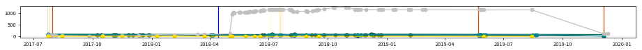</td></tr>
<tr><td colspan="11"><strong>Connective Tissue Disorders - Rheumatoid Arthritis; RA</strong></td></tr>
<tr><td>Drug \ generic \ company \ FDA approval</td><td>Regulatory code </td><td>HTTPS </td><td>:trophy: </td><td>:link: </td><td>:iphone: </td><td>:wheelchair: </td><td>:computer: </td><td>Server </td><td>ASN </td><td>&nbsp;&nbsp;&nbsp;&nbsp;&nbsp;&nbsp;&nbsp;&nbsp;&nbsp;&nbsp;&nbsp;&nbsp;&nbsp;&nbsp;&nbsp;&nbsp;&nbsp;&nbsp;&nbsp;&nbsp;&nbsp;&nbsp;&nbsp;&nbsp;&nbsp;&nbsp;&nbsp;&nbsp;&nbsp;&nbsp;&nbsp;&nbsp;&nbsp;&nbsp;&nbsp;&nbsp;&nbsp;&nbsp;&nbsp;&nbsp;&nbsp;&nbsp;&nbsp;&nbsp;&nbsp;&nbsp;&nbsp;&nbsp;&nbsp;&nbsp;&nbsp;&nbsp;&nbsp;&nbsp;&nbsp;&nbsp;&nbsp;&nbsp;&nbsp;&nbsp;&nbsp;&nbsp;&nbsp;&nbsp;&nbsp;&nbsp;&nbsp;&nbsp;&nbsp;&nbsp;&nbsp;&nbsp;&nbsp;&nbsp;&nbsp;&nbsp;&nbsp;&nbsp;&nbsp;&nbsp;&nbsp;&nbsp;&nbsp;&nbsp;&nbsp;&nbsp;&nbsp;&nbsp;&nbsp;&nbsp;&nbsp;&nbsp;&nbsp;&nbsp;&nbsp;&nbsp;&nbsp;&nbsp;&nbsp;&nbsp;&nbsp;&nbsp;&nbsp;&nbsp;&nbsp;&nbsp;&nbsp;&nbsp;&nbsp;&nbsp;&nbsp;&nbsp;&nbsp;&nbsp;&nbsp;&nbsp;&nbsp;&nbsp;&nbsp;&nbsp;&nbsp;&nbsp;&nbsp;&nbsp;&nbsp;&nbsp;&nbsp;&nbsp;&nbsp;&nbsp;&nbsp;&nbsp;&nbsp;&nbsp;&nbsp;&nbsp;&nbsp;&nbsp;&nbsp;&nbsp;&nbsp;&nbsp;&nbsp;&nbsp;&nbsp;&nbsp;&nbsp;&nbsp;&nbsp;&nbsp;&nbsp;&nbsp;&nbsp;&nbsp;&nbsp;&nbsp;&nbsp;&nbsp;&nbsp;&nbsp;&nbsp;&nbsp;&nbsp;&nbsp;&nbsp;&nbsp;&nbsp;&nbsp;&nbsp;&nbsp;&nbsp;&nbsp;&nbsp;&nbsp;&nbsp;&nbsp;&nbsp;&nbsp;&nbsp;&nbsp;&nbsp;&nbsp;&nbsp;&nbsp;&nbsp;&nbsp;&nbsp;&nbsp;&nbsp;&nbsp;&nbsp;&nbsp;&nbsp;&nbsp;&nbsp;&nbsp;&nbsp;&nbsp;&nbsp;&nbsp;&nbsp;&nbsp;&nbsp;&nbsp;&nbsp;&nbsp;&nbsp;&nbsp;&nbsp;&nbsp;&nbsp;</td></tr>
<tr><td><a href="http://arava.com" target="_blank">arava.com</a>   leflunomide systemic   Sanofi   09/10/1998</td><td>US.LEF.15.11.001 </td><td><a href="https://www.ssllabs.com/ssltest/analyze.html?d=arava.com" target="_blank">:x:</a></td><td>3.6</td><td>7</td><td><a href="https://developers.google.com/speed/pagespeed/insights/?url=arava.com&tab=mobile" target="_blank">69</a></td><td><a href="https://developers.google.com/speed/pagespeed/insights/?url=arava.com&tab=mobile" target="_blank">66</a></td><td><a href="https://developers.google.com/speed/pagespeed/insights/?url=arava.com&tab=desktop" target="_blank">80</a></td><td>Microsoft-IIS/8.5</td><td>AS36291 Aventis Pharmaceuticals Inc.</td><td>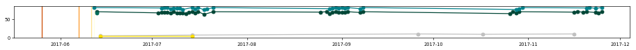</td></tr>
<tr><td><a href="http://celebrex.com" target="_blank">celebrex.com</a>   celecoxib systemic   Pfizer   12/31/1998</td><td>PP-CEL-USA-0295 </td><td><a href="https://www.ssllabs.com/ssltest/analyze.html?d=celebrex.com" target="_blank">:white_check_mark:</a></td><td>5.2</td><td>509</td><td><a href="https://developers.google.com/speed/pagespeed/insights/?url=celebrex.com&tab=mobile" target="_blank">58</a></td><td><a href="https://developers.google.com/speed/pagespeed/insights/?url=celebrex.com&tab=mobile" target="_blank">96</a></td><td><a href="https://developers.google.com/speed/pagespeed/insights/?url=celebrex.com&tab=desktop" target="_blank">77</a></td><td>cloudflare-nginx</td><td>AS13335 Cloudflare Inc</td><td>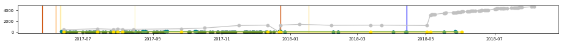</td></tr>
<tr><td><a href="http://enbrel.com" target="_blank">enbrel.com</a>   etanercept systemic   Amgen   11/02/1998</td><td>USA-ECF-111018 </td><td><a href="https://www.ssllabs.com/ssltest/analyze.html?d=enbrel.com" target="_blank">:white_check_mark:</a></td><td>5.4</td><td>597</td><td><a href="https://developers.google.com/speed/pagespeed/insights/?url=enbrel.com&tab=mobile" target="_blank">49</a></td><td><a href="https://developers.google.com/speed/pagespeed/insights/?url=enbrel.com&tab=mobile" target="_blank">97</a></td><td><a href="https://developers.google.com/speed/pagespeed/insights/?url=enbrel.com&tab=desktop" target="_blank">66</a></td><td>Microsoft-IIS/7.5</td><td>AS3561 Savvis</td><td>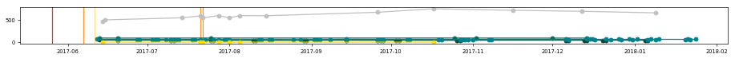</td></tr>
<tr><td><a href="http://humira.com" target="_blank">humira.com</a>   adalimumab systemic   AbbVie   12/31/2002</td><td>64H-1920421 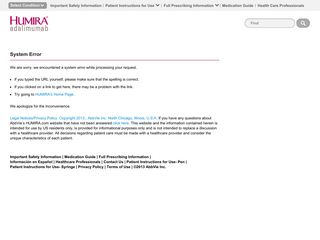</td><td><a href="https://www.ssllabs.com/ssltest/analyze.html?d=humira.com" target="_blank">:white_check_mark:</a></td><td>5.5</td><td>983</td><td><a href="https://developers.google.com/speed/pagespeed/insights/?url=humira.com&tab=mobile" target="_blank">31</a></td><td><a href="https://developers.google.com/speed/pagespeed/insights/?url=humira.com&tab=mobile" target="_blank">99</a></td><td><a href="https://developers.google.com/speed/pagespeed/insights/?url=humira.com&tab=desktop" target="_blank">34</a></td><td>Microsoft-IIS/8.0</td><td>AS27357 Rackspace Ltd.</td><td>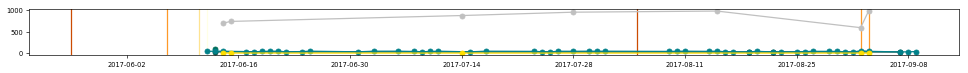</td></tr>
<tr><td><a href="http://kevzara.com" target="_blank">kevzara.com</a>   sarilumab   Sanofi and Regeneron   05/22/2017</td><td>SAUS.SARI.17.04.1651 </td><td><a href="https://www.ssllabs.com/ssltest/analyze.html?d=kevzara.com" target="_blank">:white_check_mark:</a></td><td>4.8</td><td>88</td><td><a href="https://developers.google.com/speed/pagespeed/insights/?url=kevzara.com&tab=mobile" target="_blank">66</a></td><td><a href="https://developers.google.com/speed/pagespeed/insights/?url=kevzara.com&tab=mobile" target="_blank">99</a></td><td><a href="https://developers.google.com/speed/pagespeed/insights/?url=kevzara.com&tab=desktop" target="_blank">82</a></td><td>Microsoft-IIS/8.5</td><td>AS8075 Microsoft Corporation</td><td>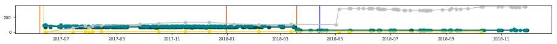</td></tr>
<tr><td><a href="http://orencia.bmscustomerconnect.com" target="_blank">orencia.bmscustomerconnect.com</a>   adalimumab systemic   Bristol-Myers Squibb   12/23/2005</td><td>427US1702381 </td><td><a href="https://www.ssllabs.com/ssltest/analyze.html?d=orencia.bmscustomerconnect.com" target="_blank">:x:</a></td><td>5.2</td><td>99</td><td><a href="https://developers.google.com/speed/pagespeed/insights/?url=orencia.bmscustomerconnect.com&tab=mobile" target="_blank">47</a></td><td><a href="https://developers.google.com/speed/pagespeed/insights/?url=orencia.bmscustomerconnect.com&tab=mobile" target="_blank">97</a></td><td><a href="https://developers.google.com/speed/pagespeed/insights/?url=orencia.bmscustomerconnect.com&tab=desktop" target="_blank">61</a></td><td></td><td>AS7246 Bristol-Myers Squibb Company</td><td>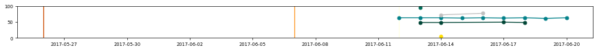</td></tr>
<tr><td><a href="http://remicade.com/rheumatoid-arthritis" target="_blank">remicade.com/rheumatoid-arthritis</a>   infliximab systemic   Janssen   08/24/1998</td><td>035714-150617 </td><td><a href="https://www.ssllabs.com/ssltest/analyze.html?d=remicade.com/rheumatoid-arthritis" target="_blank">:white_check_mark:</a></td><td>4.5</td><td>51</td><td><a href="https://developers.google.com/speed/pagespeed/insights/?url=remicade.com/rheumatoid-arthritis&tab=mobile" target="_blank">60</a></td><td><a href="https://developers.google.com/speed/pagespeed/insights/?url=remicade.com/rheumatoid-arthritis&tab=mobile" target="_blank">100</a></td><td><a href="https://developers.google.com/speed/pagespeed/insights/?url=remicade.com/rheumatoid-arthritis&tab=desktop" target="_blank">76</a></td><td>nginx</td><td>AS14618 Amazon.com, Inc.</td><td>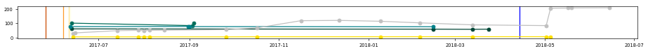</td></tr>
<tr><td><a href="http://vimovo.com" target="_blank">vimovo.com</a>   esomeprazole / naproxen systemic   Horizon Pharma   04/30/2010</td><td>0026VMV02 </td><td><a href="https://www.ssllabs.com/ssltest/analyze.html?d=vimovo.com" target="_blank">:white_check_mark:</a></td><td>5.5</td><td>197</td><td><a href="https://developers.google.com/speed/pagespeed/insights/?url=vimovo.com&tab=mobile" target="_blank">77</a></td><td><a href="https://developers.google.com/speed/pagespeed/insights/?url=vimovo.com&tab=mobile" target="_blank">98</a></td><td><a href="https://developers.google.com/speed/pagespeed/insights/?url=vimovo.com&tab=desktop" target="_blank">90</a></td><td>cloudflare-nginx</td><td>AS13335 Cloudflare Inc</td><td>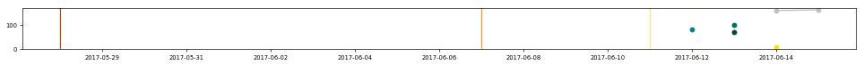</td></tr>
<tr><td colspan="11"><strong>Metabolic Disorders - Obesity</strong></td></tr>
<tr><td>Drug \ generic \ company \ FDA approval</td><td>Regulatory code </td><td>HTTPS </td><td>:trophy: </td><td>:link: </td><td>:iphone: </td><td>:wheelchair: </td><td>:computer: </td><td>Server </td><td>ASN </td><td>&nbsp;&nbsp;&nbsp;&nbsp;&nbsp;&nbsp;&nbsp;&nbsp;&nbsp;&nbsp;&nbsp;&nbsp;&nbsp;&nbsp;&nbsp;&nbsp;&nbsp;&nbsp;&nbsp;&nbsp;&nbsp;&nbsp;&nbsp;&nbsp;&nbsp;&nbsp;&nbsp;&nbsp;&nbsp;&nbsp;&nbsp;&nbsp;&nbsp;&nbsp;&nbsp;&nbsp;&nbsp;&nbsp;&nbsp;&nbsp;&nbsp;&nbsp;&nbsp;&nbsp;&nbsp;&nbsp;&nbsp;&nbsp;&nbsp;&nbsp;&nbsp;&nbsp;&nbsp;&nbsp;&nbsp;&nbsp;&nbsp;&nbsp;&nbsp;&nbsp;&nbsp;&nbsp;&nbsp;&nbsp;&nbsp;&nbsp;&nbsp;&nbsp;&nbsp;&nbsp;&nbsp;&nbsp;&nbsp;&nbsp;&nbsp;&nbsp;&nbsp;&nbsp;&nbsp;&nbsp;&nbsp;&nbsp;&nbsp;&nbsp;&nbsp;&nbsp;&nbsp;&nbsp;&nbsp;&nbsp;&nbsp;&nbsp;&nbsp;&nbsp;&nbsp;&nbsp;&nbsp;&nbsp;&nbsp;&nbsp;&nbsp;&nbsp;&nbsp;&nbsp;&nbsp;&nbsp;&nbsp;&nbsp;&nbsp;&nbsp;&nbsp;&nbsp;&nbsp;&nbsp;&nbsp;&nbsp;&nbsp;&nbsp;&nbsp;&nbsp;&nbsp;&nbsp;&nbsp;&nbsp;&nbsp;&nbsp;&nbsp;&nbsp;&nbsp;&nbsp;&nbsp;&nbsp;&nbsp;&nbsp;&nbsp;&nbsp;&nbsp;&nbsp;&nbsp;&nbsp;&nbsp;&nbsp;&nbsp;&nbsp;&nbsp;&nbsp;&nbsp;&nbsp;&nbsp;&nbsp;&nbsp;&nbsp;&nbsp;&nbsp;&nbsp;&nbsp;&nbsp;&nbsp;&nbsp;&nbsp;&nbsp;&nbsp;&nbsp;&nbsp;&nbsp;&nbsp;&nbsp;&nbsp;&nbsp;&nbsp;&nbsp;&nbsp;&nbsp;&nbsp;&nbsp;&nbsp;&nbsp;&nbsp;&nbsp;&nbsp;&nbsp;&nbsp;&nbsp;&nbsp;&nbsp;&nbsp;&nbsp;&nbsp;&nbsp;&nbsp;&nbsp;&nbsp;&nbsp;&nbsp;&nbsp;&nbsp;&nbsp;&nbsp;&nbsp;&nbsp;&nbsp;&nbsp;&nbsp;&nbsp;&nbsp;&nbsp;&nbsp;&nbsp;&nbsp;&nbsp;&nbsp;</td></tr>
<tr><td><a href="http://belviq.com" target="_blank">belviq.com</a>   lorcaserin systemic   Eisai   06/27/2012</td><td>BVXR-US0052 </td><td><a href="https://www.ssllabs.com/ssltest/analyze.html?d=belviq.com" target="_blank">:white_check_mark:</a></td><td>5.8</td><td>831</td><td><a href="https://developers.google.com/speed/pagespeed/insights/?url=belviq.com&tab=mobile" target="_blank">64</a></td><td><a href="https://developers.google.com/speed/pagespeed/insights/?url=belviq.com&tab=mobile" target="_blank">96</a></td><td><a href="https://developers.google.com/speed/pagespeed/insights/?url=belviq.com&tab=desktop" target="_blank">82</a></td><td>Microsoft-IIS/8.5</td><td>AS46203 ProNet Solutions, Inc.</td><td>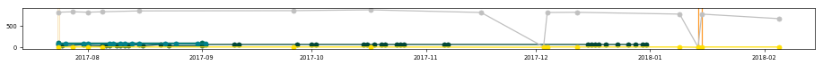</td></tr>
<tr><td><a href="http://contrave.com" target="_blank">contrave.com</a>   lbupropion / naltrexone systemic   Orexigen   09/10/2014</td><td>FDA-1088 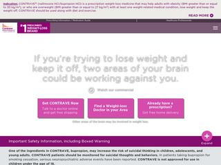</td><td><a href="https://www.ssllabs.com/ssltest/analyze.html?d=contrave.com" target="_blank">:white_check_mark:</a></td><td>5.6</td><td>1669</td><td><a href="https://developers.google.com/speed/pagespeed/insights/?url=contrave.com&tab=mobile" target="_blank">50</a></td><td><a href="https://developers.google.com/speed/pagespeed/insights/?url=contrave.com&tab=mobile" target="_blank">99</a></td><td><a href="https://developers.google.com/speed/pagespeed/insights/?url=contrave.com&tab=desktop" target="_blank">60</a></td><td>nginx/1.10.1</td><td>AS14618 Amazon.com, Inc.</td><td>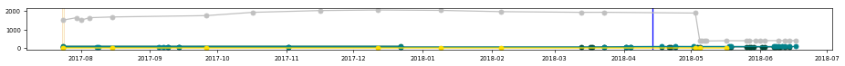</td></tr>
<tr><td><a href="http://saxenda.com" target="_blank">saxenda.com</a>   liraglutide systemic   Novo Nordisk   12/23/2014</td><td>USA17SAM01099 </td><td><a href="https://www.ssllabs.com/ssltest/analyze.html?d=saxenda.com" target="_blank">:x:</a></td><td>5.1</td><td>85</td><td><a href="https://developers.google.com/speed/pagespeed/insights/?url=saxenda.com&tab=mobile" target="_blank">34</a></td><td><a href="https://developers.google.com/speed/pagespeed/insights/?url=saxenda.com&tab=mobile" target="_blank">99</a></td><td><a href="https://developers.google.com/speed/pagespeed/insights/?url=saxenda.com&tab=desktop" target="_blank">42</a></td><td>Apache/2.4.25 (Red Hat) OpenSSL/1.0.1e-fips Communique/4.1.9</td><td>AS33070 Rackspace Ltd.</td><td>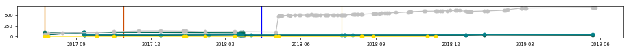</td></tr>
<tr><td><a href="http://qsymia.com" target="_blank">qsymia.com</a>   phentermine / topiramate systemic   Vivus   07/17/2012</td><td>100028.36 </td><td><a href="https://www.ssllabs.com/ssltest/analyze.html?d=qsymia.com" target="_blank">:white_check_mark:</a></td><td>5.8</td><td>287</td><td><a href="https://developers.google.com/speed/pagespeed/insights/?url=qsymia.com&tab=mobile" target="_blank">69</a></td><td><a href="https://developers.google.com/speed/pagespeed/insights/?url=qsymia.com&tab=mobile" target="_blank">97</a></td><td><a href="https://developers.google.com/speed/pagespeed/insights/?url=qsymia.com&tab=desktop" target="_blank">82</a></td><td>nginx/1.0.15</td><td>AS19994 Rackspace Ltd.</td><td>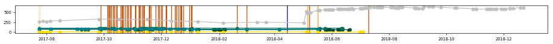</td></tr>
<tr><td colspan="11"><strong>Respiratory Tract Disease - Chronic Obstructive Pulmonary Disease; COPD</strong></td></tr>
<tr><td>Drug \ generic \ company \ FDA approval</td><td>Regulatory code </td><td>HTTPS </td><td>:trophy: </td><td>:link: </td><td>:iphone: </td><td>:wheelchair: </td><td>:computer: </td><td>Server </td><td>ASN </td><td>&nbsp;&nbsp;&nbsp;&nbsp;&nbsp;&nbsp;&nbsp;&nbsp;&nbsp;&nbsp;&nbsp;&nbsp;&nbsp;&nbsp;&nbsp;&nbsp;&nbsp;&nbsp;&nbsp;&nbsp;&nbsp;&nbsp;&nbsp;&nbsp;&nbsp;&nbsp;&nbsp;&nbsp;&nbsp;&nbsp;&nbsp;&nbsp;&nbsp;&nbsp;&nbsp;&nbsp;&nbsp;&nbsp;&nbsp;&nbsp;&nbsp;&nbsp;&nbsp;&nbsp;&nbsp;&nbsp;&nbsp;&nbsp;&nbsp;&nbsp;&nbsp;&nbsp;&nbsp;&nbsp;&nbsp;&nbsp;&nbsp;&nbsp;&nbsp;&nbsp;&nbsp;&nbsp;&nbsp;&nbsp;&nbsp;&nbsp;&nbsp;&nbsp;&nbsp;&nbsp;&nbsp;&nbsp;&nbsp;&nbsp;&nbsp;&nbsp;&nbsp;&nbsp;&nbsp;&nbsp;&nbsp;&nbsp;&nbsp;&nbsp;&nbsp;&nbsp;&nbsp;&nbsp;&nbsp;&nbsp;&nbsp;&nbsp;&nbsp;&nbsp;&nbsp;&nbsp;&nbsp;&nbsp;&nbsp;&nbsp;&nbsp;&nbsp;&nbsp;&nbsp;&nbsp;&nbsp;&nbsp;&nbsp;&nbsp;&nbsp;&nbsp;&nbsp;&nbsp;&nbsp;&nbsp;&nbsp;&nbsp;&nbsp;&nbsp;&nbsp;&nbsp;&nbsp;&nbsp;&nbsp;&nbsp;&nbsp;&nbsp;&nbsp;&nbsp;&nbsp;&nbsp;&nbsp;&nbsp;&nbsp;&nbsp;&nbsp;&nbsp;&nbsp;&nbsp;&nbsp;&nbsp;&nbsp;&nbsp;&nbsp;&nbsp;&nbsp;&nbsp;&nbsp;&nbsp;&nbsp;&nbsp;&nbsp;&nbsp;&nbsp;&nbsp;&nbsp;&nbsp;&nbsp;&nbsp;&nbsp;&nbsp;&nbsp;&nbsp;&nbsp;&nbsp;&nbsp;&nbsp;&nbsp;&nbsp;&nbsp;&nbsp;&nbsp;&nbsp;&nbsp;&nbsp;&nbsp;&nbsp;&nbsp;&nbsp;&nbsp;&nbsp;&nbsp;&nbsp;&nbsp;&nbsp;&nbsp;&nbsp;&nbsp;&nbsp;&nbsp;&nbsp;&nbsp;&nbsp;&nbsp;&nbsp;&nbsp;&nbsp;&nbsp;&nbsp;&nbsp;&nbsp;&nbsp;&nbsp;&nbsp;&nbsp;&nbsp;&nbsp;&nbsp;&nbsp;&nbsp;&nbsp;</td></tr>
<tr><td><a href="http://bevespi.com" target="_blank">bevespi.com</a>   formoterol / glycopyrrolate   AstraZeneca   04/25/2016</td><td>2047004-3340900 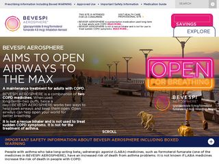</td><td><a href="https://www.ssllabs.com/ssltest/analyze.html?d=bevespi.com" target="_blank">:white_check_mark:</a></td><td>5.9</td><td>9</td><td><a href="https://developers.google.com/speed/pagespeed/insights/?url=bevespi.com&tab=mobile" target="_blank">43</a></td><td><a href="https://developers.google.com/speed/pagespeed/insights/?url=bevespi.com&tab=mobile" target="_blank">98</a></td><td><a href="https://developers.google.com/speed/pagespeed/insights/?url=bevespi.com&tab=desktop" target="_blank">55</a></td><td>Apache</td><td>AS16509 Amazon.com, Inc.</td><td>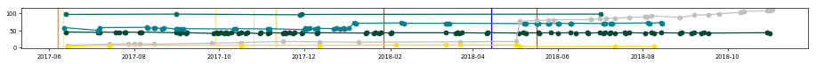</td></tr>
<tr><td><a href="http://daliresp.com" target="_blank">daliresp.com</a>   roflumilast systemic   AstraZeneca   02/28/2011</td><td>1954809-3190628 </td><td><a href="https://www.ssllabs.com/ssltest/analyze.html?d=daliresp.com" target="_blank">:white_check_mark:</a></td><td>6.1</td><td>44</td><td><a href="https://developers.google.com/speed/pagespeed/insights/?url=daliresp.com&tab=mobile" target="_blank">55</a></td><td><a href="https://developers.google.com/speed/pagespeed/insights/?url=daliresp.com&tab=mobile" target="_blank">84</a></td><td><a href="https://developers.google.com/speed/pagespeed/insights/?url=daliresp.com&tab=desktop" target="_blank">79</a></td><td>Apache</td><td>AS16509 Amazon.com, Inc.</td><td>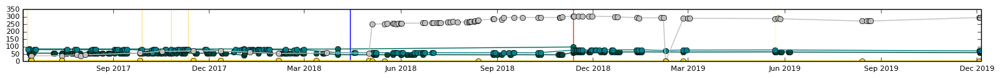</td></tr>
<tr><td><a href="http://mysymbicort.com" target="_blank">mysymbicort.com</a>   budesonide / formoterol   AstraZeneca   07/21/2006</td><td>1945203-3326734 </td><td><a href="https://www.ssllabs.com/ssltest/analyze.html?d=mysymbicort.com" target="_blank">:white_check_mark:</a></td><td>4.9</td><td>438</td><td><a href="https://developers.google.com/speed/pagespeed/insights/?url=mysymbicort.com&tab=mobile" target="_blank">54</a></td><td><a href="https://developers.google.com/speed/pagespeed/insights/?url=mysymbicort.com&tab=mobile" target="_blank">98</a></td><td><a href="https://developers.google.com/speed/pagespeed/insights/?url=mysymbicort.com&tab=desktop" target="_blank">77</a></td><td>Apache</td><td>AS16509 Amazon.com, Inc.</td><td>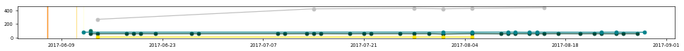</td></tr>
<tr><td><a href="http://startwithanoro.com" target="_blank">startwithanoro.com</a>   umeclidinium / vilanterol   GSK   12/18/2013</td><td>783658R0 </td><td><a href="https://www.ssllabs.com/ssltest/analyze.html?d=startwithanoro.com" target="_blank">:x:</a></td><td>4.2</td><td>18</td><td><a href="https://developers.google.com/speed/pagespeed/insights/?url=startwithanoro.com&tab=mobile" target="_blank">55</a></td><td><a href="https://developers.google.com/speed/pagespeed/insights/?url=startwithanoro.com&tab=mobile" target="_blank">98</a></td><td><a href="https://developers.google.com/speed/pagespeed/insights/?url=startwithanoro.com&tab=desktop" target="_blank">67</a></td><td>Apache</td><td>AS14618 Amazon.com, Inc.</td><td>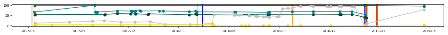</td></tr>
<tr><td colspan="11"><strong>Respiratory Tract Disease - Pulmonary Arterial Hypertension; PAH</strong></td></tr>
<tr><td>Drug \ generic \ company \ FDA approval</td><td>Regulatory code </td><td>HTTPS </td><td>:trophy: </td><td>:link: </td><td>:iphone: </td><td>:wheelchair: </td><td>:computer: </td><td>Server </td><td>ASN </td><td>&nbsp;&nbsp;&nbsp;&nbsp;&nbsp;&nbsp;&nbsp;&nbsp;&nbsp;&nbsp;&nbsp;&nbsp;&nbsp;&nbsp;&nbsp;&nbsp;&nbsp;&nbsp;&nbsp;&nbsp;&nbsp;&nbsp;&nbsp;&nbsp;&nbsp;&nbsp;&nbsp;&nbsp;&nbsp;&nbsp;&nbsp;&nbsp;&nbsp;&nbsp;&nbsp;&nbsp;&nbsp;&nbsp;&nbsp;&nbsp;&nbsp;&nbsp;&nbsp;&nbsp;&nbsp;&nbsp;&nbsp;&nbsp;&nbsp;&nbsp;&nbsp;&nbsp;&nbsp;&nbsp;&nbsp;&nbsp;&nbsp;&nbsp;&nbsp;&nbsp;&nbsp;&nbsp;&nbsp;&nbsp;&nbsp;&nbsp;&nbsp;&nbsp;&nbsp;&nbsp;&nbsp;&nbsp;&nbsp;&nbsp;&nbsp;&nbsp;&nbsp;&nbsp;&nbsp;&nbsp;&nbsp;&nbsp;&nbsp;&nbsp;&nbsp;&nbsp;&nbsp;&nbsp;&nbsp;&nbsp;&nbsp;&nbsp;&nbsp;&nbsp;&nbsp;&nbsp;&nbsp;&nbsp;&nbsp;&nbsp;&nbsp;&nbsp;&nbsp;&nbsp;&nbsp;&nbsp;&nbsp;&nbsp;&nbsp;&nbsp;&nbsp;&nbsp;&nbsp;&nbsp;&nbsp;&nbsp;&nbsp;&nbsp;&nbsp;&nbsp;&nbsp;&nbsp;&nbsp;&nbsp;&nbsp;&nbsp;&nbsp;&nbsp;&nbsp;&nbsp;&nbsp;&nbsp;&nbsp;&nbsp;&nbsp;&nbsp;&nbsp;&nbsp;&nbsp;&nbsp;&nbsp;&nbsp;&nbsp;&nbsp;&nbsp;&nbsp;&nbsp;&nbsp;&nbsp;&nbsp;&nbsp;&nbsp;&nbsp;&nbsp;&nbsp;&nbsp;&nbsp;&nbsp;&nbsp;&nbsp;&nbsp;&nbsp;&nbsp;&nbsp;&nbsp;&nbsp;&nbsp;&nbsp;&nbsp;&nbsp;&nbsp;&nbsp;&nbsp;&nbsp;&nbsp;&nbsp;&nbsp;&nbsp;&nbsp;&nbsp;&nbsp;&nbsp;&nbsp;&nbsp;&nbsp;&nbsp;&nbsp;&nbsp;&nbsp;&nbsp;&nbsp;&nbsp;&nbsp;&nbsp;&nbsp;&nbsp;&nbsp;&nbsp;&nbsp;&nbsp;&nbsp;&nbsp;&nbsp;&nbsp;&nbsp;&nbsp;&nbsp;&nbsp;&nbsp;&nbsp;&nbsp;</td></tr>
<tr><td><a href="http://4ventavis.com" target="_blank">4ventavis.com</a>   iloprost systemic   Actelion   12/29/2004</td><td>VEN-00213 </td><td><a href="https://www.ssllabs.com/ssltest/analyze.html?d=4ventavis.com" target="_blank">:white_check_mark:</a></td><td>5.0</td><td>101</td><td><a href="https://developers.google.com/speed/pagespeed/insights/?url=4ventavis.com&tab=mobile" target="_blank">54</a></td><td><a href="https://developers.google.com/speed/pagespeed/insights/?url=4ventavis.com&tab=mobile" target="_blank">70</a></td><td><a href="https://developers.google.com/speed/pagespeed/insights/?url=4ventavis.com&tab=desktop" target="_blank">69</a></td><td>Microsoft-IIS/8.5</td><td>AS19551 Incapsula Inc</td><td>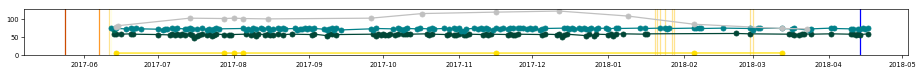</td></tr>
<tr><td><a href="http://adcirca.com" target="_blank">adcirca.com</a>   tadalafil systemic   United Therapeutics   05/22/2009</td><td>US/ADC/SEP11/066 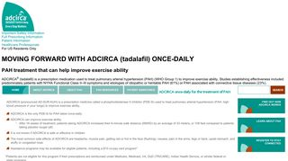</td><td><a href="https://www.ssllabs.com/ssltest/analyze.html?d=adcirca.com" target="_blank">:white_check_mark:</a></td><td>4.3</td><td>43</td><td><a href="https://developers.google.com/speed/pagespeed/insights/?url=adcirca.com&tab=mobile" target="_blank">57</a></td><td><a href="https://developers.google.com/speed/pagespeed/insights/?url=adcirca.com&tab=mobile" target="_blank">65</a></td><td><a href="https://developers.google.com/speed/pagespeed/insights/?url=adcirca.com&tab=desktop" target="_blank">68</a></td><td>Microsoft-IIS/8.0</td><td>AS8075 Microsoft Corporation</td><td>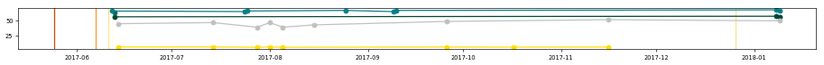</td></tr>
<tr><td><a href="http://adempas-us.com" target="_blank">adempas-us.com</a>   riociguat   Bayer   10/08/2013</td><td>02/2017 </td><td><a href="https://www.ssllabs.com/ssltest/analyze.html?d=adempas-us.com" target="_blank">:x:</a></td><td>4.7</td><td>18</td><td><a href="https://developers.google.com/speed/pagespeed/insights/?url=adempas-us.com&tab=mobile" target="_blank">61</a></td><td><a href="https://developers.google.com/speed/pagespeed/insights/?url=adempas-us.com&tab=mobile" target="_blank">92</a></td><td><a href="https://developers.google.com/speed/pagespeed/insights/?url=adempas-us.com&tab=desktop" target="_blank">79</a></td><td>Apache</td><td>AS19574 Corporation Service Company</td><td>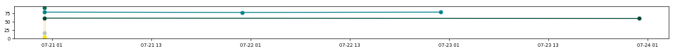</td></tr>
<tr><td><a href="http://letairis.com" target="_blank">letairis.com</a>   ambrisentan systemic   Gilead   06/15/2007</td><td>LETC0280 </td><td><a href="https://www.ssllabs.com/ssltest/analyze.html?d=letairis.com" target="_blank">:white_check_mark:</a></td><td>4.5</td><td>31</td><td><a href="https://developers.google.com/speed/pagespeed/insights/?url=letairis.com&tab=mobile" target="_blank">58</a></td><td><a href="https://developers.google.com/speed/pagespeed/insights/?url=letairis.com&tab=mobile" target="_blank">100</a></td><td><a href="https://developers.google.com/speed/pagespeed/insights/?url=letairis.com&tab=desktop" target="_blank">75</a></td><td>Microsoft-IIS/8.5</td><td>AS27357 Rackspace Ltd.</td><td>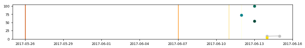</td></tr>
<tr><td><a href="http://opsumit.com" target="_blank">opsumit.com</a>   macitentan systemic   Actelion   10/18/2013</td><td>MAC-01221 </td><td><a href="https://www.ssllabs.com/ssltest/analyze.html?d=opsumit.com" target="_blank">:white_check_mark:</a></td><td>0</td><td>3</td><td><a href="https://developers.google.com/speed/pagespeed/insights/?url=opsumit.com&tab=mobile" target="_blank">40</a></td><td><a href="https://developers.google.com/speed/pagespeed/insights/?url=opsumit.com&tab=mobile" target="_blank">99</a></td><td><a href="https://developers.google.com/speed/pagespeed/insights/?url=opsumit.com&tab=desktop" target="_blank">49</a></td><td>Microsoft-IIS/8.5</td><td>AS16509 Amazon.com, Inc.</td><td>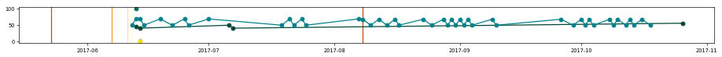</td></tr>
<tr><td><a href="http://orenitram.com" target="_blank">orenitram.com</a>   treprostinil systemic   United Therapeutics   12/20/2013</td><td>US/ORE/0159 </td><td><a href="https://www.ssllabs.com/ssltest/analyze.html?d=orenitram.com" target="_blank">:white_check_mark:</a></td><td>4.8</td><td>41</td><td><a href="https://developers.google.com/speed/pagespeed/insights/?url=orenitram.com&tab=mobile" target="_blank">54</a></td><td><a href="https://developers.google.com/speed/pagespeed/insights/?url=orenitram.com&tab=mobile" target="_blank">95</a></td><td><a href="https://developers.google.com/speed/pagespeed/insights/?url=orenitram.com&tab=desktop" target="_blank">62</a></td><td>Microsoft-IIS/8.0</td><td>AS8075 Microsoft Corporation</td><td></td></tr>
<tr><td><a href="http://remodulin.com" target="_blank">remodulin.com</a>   treprostinil systemic   United Therapeutics   07/05/2001</td><td>US/REM/OCT15/262 </td><td><a href="https://www.ssllabs.com/ssltest/analyze.html?d=remodulin.com" target="_blank">:white_check_mark:</a></td><td>5.6</td><td>162</td><td><a href="https://developers.google.com/speed/pagespeed/insights/?url=remodulin.com&tab=mobile" target="_blank">70</a></td><td><a href="https://developers.google.com/speed/pagespeed/insights/?url=remodulin.com&tab=mobile" target="_blank">96</a></td><td><a href="https://developers.google.com/speed/pagespeed/insights/?url=remodulin.com&tab=desktop" target="_blank">74</a></td><td>Microsoft-IIS/8.0</td><td>AS8075 Microsoft Corporation</td><td></td></tr>
<tr><td><a href="http://revatio.com" target="_blank">revatio.com</a>   sildenafil systemic   Pfizer   06/03/2005</td><td>RVU787202 </td><td><a href="https://www.ssllabs.com/ssltest/analyze.html?d=revatio.com" target="_blank">:x:</a></td><td>4.6</td><td>83</td><td><a href="https://developers.google.com/speed/pagespeed/insights/?url=revatio.com&tab=mobile" target="_blank">67</a></td><td><a href="https://developers.google.com/speed/pagespeed/insights/?url=revatio.com&tab=mobile" target="_blank">95</a></td><td><a href="https://developers.google.com/speed/pagespeed/insights/?url=revatio.com&tab=desktop" target="_blank">82</a></td><td>nginx</td><td>AS16509 Amazon.com, Inc.</td><td></td></tr>
<tr><td><a href="http://tracleer.com" target="_blank">tracleer.com</a>   bosentan systemic   Actelion   11/20/2001</td><td>TRA-00382 </td><td><a href="https://www.ssllabs.com/ssltest/analyze.html?d=tracleer.com" target="_blank">:x:</a></td><td>0</td><td>0</td><td><a href="https://developers.google.com/speed/pagespeed/insights/?url=tracleer.com&tab=mobile" target="_blank">62</a></td><td><a href="https://developers.google.com/speed/pagespeed/insights/?url=tracleer.com&tab=mobile" target="_blank">67</a></td><td><a href="https://developers.google.com/speed/pagespeed/insights/?url=tracleer.com&tab=desktop" target="_blank">82</a></td><td>Microsoft-IIS/8.5</td><td>AS16509 Amazon.com, Inc.</td><td></td></tr>
<tr><td><a href="http://tyvaso.com" target="_blank">tyvaso.com</a>   treprostinil systemic   United Therapeutics   07/30/2009</td><td>US/TYV/AUG15/354 </td><td><a href="https://www.ssllabs.com/ssltest/analyze.html?d=tyvaso.com" target="_blank">:white_check_mark:</a></td><td>4.7</td><td>16</td><td><a href="https://developers.google.com/speed/pagespeed/insights/?url=tyvaso.com&tab=mobile" target="_blank">59</a></td><td><a href="https://developers.google.com/speed/pagespeed/insights/?url=tyvaso.com&tab=mobile" target="_blank">90</a></td><td><a href="https://developers.google.com/speed/pagespeed/insights/?url=tyvaso.com&tab=desktop" target="_blank">71</a></td><td>Microsoft-IIS/8.0</td><td>AS8075 Microsoft Corporation</td><td></td></tr>
<tr><td><a href="http://uptravi.com" target="_blank">uptravi.com</a>   selexipag systemic   Actelion   12/21/2015</td><td>SLX-00318 </td><td><a href="https://www.ssllabs.com/ssltest/analyze.html?d=uptravi.com" target="_blank">:x:</a></td><td>4.7</td><td>16</td><td><a href="https://developers.google.com/speed/pagespeed/insights/?url=uptravi.com&tab=mobile" target="_blank">41</a></td><td><a href="https://developers.google.com/speed/pagespeed/insights/?url=uptravi.com&tab=mobile" target="_blank">86</a></td><td><a href="https://developers.google.com/speed/pagespeed/insights/?url=uptravi.com&tab=desktop" target="_blank">47</a></td><td></td><td></td><td></td></tr>
<tr><td><a href="http://veletri.com" target="_blank">veletri.com</a>   epoprostenol systemic   Actelion   06/27/2008</td><td>VEL-00269 </td><td><a href="https://www.ssllabs.com/ssltest/analyze.html?d=veletri.com" target="_blank">:white_check_mark:</a></td><td>0</td><td>2</td><td><a href="https://developers.google.com/speed/pagespeed/insights/?url=veletri.com&tab=mobile" target="_blank">62</a></td><td><a href="https://developers.google.com/speed/pagespeed/insights/?url=veletri.com&tab=mobile" target="_blank">61</a></td><td><a href="https://developers.google.com/speed/pagespeed/insights/?url=veletri.com&tab=desktop" target="_blank">78</a></td><td>Microsoft-IIS/8.5</td><td>AS19551 Incapsula Inc</td><td></td></tr>
<tr><td colspan="11"><strong>Viral Infection - Human Immunodeficiency Virus Infection; HIV</strong></td></tr>
<tr><td>Drug \ generic \ company \ FDA approval</td><td>Regulatory code </td><td>HTTPS </td><td>:trophy: </td><td>:link: </td><td>:iphone: </td><td>:wheelchair: </td><td>:computer: </td><td>Server </td><td>ASN </td><td>&nbsp;&nbsp;&nbsp;&nbsp;&nbsp;&nbsp;&nbsp;&nbsp;&nbsp;&nbsp;&nbsp;&nbsp;&nbsp;&nbsp;&nbsp;&nbsp;&nbsp;&nbsp;&nbsp;&nbsp;&nbsp;&nbsp;&nbsp;&nbsp;&nbsp;&nbsp;&nbsp;&nbsp;&nbsp;&nbsp;&nbsp;&nbsp;&nbsp;&nbsp;&nbsp;&nbsp;&nbsp;&nbsp;&nbsp;&nbsp;&nbsp;&nbsp;&nbsp;&nbsp;&nbsp;&nbsp;&nbsp;&nbsp;&nbsp;&nbsp;&nbsp;&nbsp;&nbsp;&nbsp;&nbsp;&nbsp;&nbsp;&nbsp;&nbsp;&nbsp;&nbsp;&nbsp;&nbsp;&nbsp;&nbsp;&nbsp;&nbsp;&nbsp;&nbsp;&nbsp;&nbsp;&nbsp;&nbsp;&nbsp;&nbsp;&nbsp;&nbsp;&nbsp;&nbsp;&nbsp;&nbsp;&nbsp;&nbsp;&nbsp;&nbsp;&nbsp;&nbsp;&nbsp;&nbsp;&nbsp;&nbsp;&nbsp;&nbsp;&nbsp;&nbsp;&nbsp;&nbsp;&nbsp;&nbsp;&nbsp;&nbsp;&nbsp;&nbsp;&nbsp;&nbsp;&nbsp;&nbsp;&nbsp;&nbsp;&nbsp;&nbsp;&nbsp;&nbsp;&nbsp;&nbsp;&nbsp;&nbsp;&nbsp;&nbsp;&nbsp;&nbsp;&nbsp;&nbsp;&nbsp;&nbsp;&nbsp;&nbsp;&nbsp;&nbsp;&nbsp;&nbsp;&nbsp;&nbsp;&nbsp;&nbsp;&nbsp;&nbsp;&nbsp;&nbsp;&nbsp;&nbsp;&nbsp;&nbsp;&nbsp;&nbsp;&nbsp;&nbsp;&nbsp;&nbsp;&nbsp;&nbsp;&nbsp;&nbsp;&nbsp;&nbsp;&nbsp;&nbsp;&nbsp;&nbsp;&nbsp;&nbsp;&nbsp;&nbsp;&nbsp;&nbsp;&nbsp;&nbsp;&nbsp;&nbsp;&nbsp;&nbsp;&nbsp;&nbsp;&nbsp;&nbsp;&nbsp;&nbsp;&nbsp;&nbsp;&nbsp;&nbsp;&nbsp;&nbsp;&nbsp;&nbsp;&nbsp;&nbsp;&nbsp;&nbsp;&nbsp;&nbsp;&nbsp;&nbsp;&nbsp;&nbsp;&nbsp;&nbsp;&nbsp;&nbsp;&nbsp;&nbsp;&nbsp;&nbsp;&nbsp;&nbsp;&nbsp;&nbsp;&nbsp;&nbsp;&nbsp;&nbsp;</td></tr>
<tr><td><a href="http://atripla.com" target="_blank">atripla.com</a>   favirenz / emtricitabine / tenofovir systemic   Bristol-Myers Squibb   07/12/2006</td><td>697US1500118 </td><td><a href="https://www.ssllabs.com/ssltest/analyze.html?d=atripla.com" target="_blank">:x:</a></td><td>5.4</td><td>367</td><td><a href="https://developers.google.com/speed/pagespeed/insights/?url=atripla.com&tab=mobile" target="_blank">50</a></td><td><a href="https://developers.google.com/speed/pagespeed/insights/?url=atripla.com&tab=mobile" target="_blank">100</a></td><td><a href="https://developers.google.com/speed/pagespeed/insights/?url=atripla.com&tab=desktop" target="_blank">59</a></td><td></td><td>AS7246 Bristol-Myers Squibb Company</td><td></td></tr>
<tr><td><a href="http://isentress.com" target="_blank">isentress.com</a>   raltegravir systemic   Merck   10/12/2007</td><td>INFC-1066246-0013 </td><td><a href="https://www.ssllabs.com/ssltest/analyze.html?d=isentress.com" target="_blank">:white_check_mark:</a></td><td>4.0</td><td>12</td><td><a href="https://developers.google.com/speed/pagespeed/insights/?url=isentress.com&tab=mobile" target="_blank">58</a></td><td><a href="https://developers.google.com/speed/pagespeed/insights/?url=isentress.com&tab=mobile" target="_blank">93</a></td><td><a href="https://developers.google.com/speed/pagespeed/insights/?url=isentress.com&tab=desktop" target="_blank">74</a></td><td>Apache/2.2.22 (Ubuntu)</td><td>AS14618 Amazon.com, Inc.</td><td></td></tr>
<tr><td><a href="http://norvir.com" target="_blank">norvir.com</a>   ritonavir systemic   AbbVie   03/01/1996</td><td>1750685-1881419 </td><td><a href="https://www.ssllabs.com/ssltest/analyze.html?d=norvir.com" target="_blank">:x:</a></td><td>4.0</td><td>10</td><td><a href="https://developers.google.com/speed/pagespeed/insights/?url=norvir.com&tab=mobile" target="_blank">50</a></td><td><a href="https://developers.google.com/speed/pagespeed/insights/?url=norvir.com&tab=mobile" target="_blank">100</a></td><td><a href="https://developers.google.com/speed/pagespeed/insights/?url=norvir.com&tab=desktop" target="_blank">73</a></td><td>Microsoft-IIS/8.5</td><td>AS62763 AbbVie, Inc.</td><td></td></tr>
<tr><td><a href="http://prezcobix.com" target="_blank">prezcobix.com</a>   darunavir systemic   Janssen   01/29/2015</td><td>060627-161017 </td><td><a href="https://www.ssllabs.com/ssltest/analyze.html?d=prezcobix.com" target="_blank">:white_check_mark:</a></td><td>5.0</td><td>82</td><td><a href="https://developers.google.com/speed/pagespeed/insights/?url=prezcobix.com&tab=mobile" target="_blank">44</a></td><td><a href="https://developers.google.com/speed/pagespeed/insights/?url=prezcobix.com&tab=mobile" target="_blank">94</a></td><td><a href="https://developers.google.com/speed/pagespeed/insights/?url=prezcobix.com&tab=desktop" target="_blank">61</a></td><td>nginx</td><td>AS14618 Amazon.com, Inc.</td><td></td></tr>
<tr><td><a href="http://start.truvada.com" target="_blank">start.truvada.com</a>   emtricitabine / tenofovir systemic   Gilead   08/02/2004</td><td>TVDC0090 </td><td><a href="https://www.ssllabs.com/ssltest/analyze.html?d=start.truvada.com" target="_blank">:white_check_mark:</a></td><td>5.4</td><td>947</td><td><a href="https://developers.google.com/speed/pagespeed/insights/?url=start.truvada.com&tab=mobile" target="_blank">54</a></td><td><a href="https://developers.google.com/speed/pagespeed/insights/?url=start.truvada.com&tab=mobile" target="_blank">94</a></td><td><a href="https://developers.google.com/speed/pagespeed/insights/?url=start.truvada.com&tab=desktop" target="_blank">64</a></td><td>Microsoft-IIS/8.5</td><td>AS19994 Rackspace Ltd.</td><td></td></tr>
</table>
