# moai
:moyai: Pharmaceutical competitive intelligence through product website FDA OPDP update frequency.

Moai /ˈmoʊ.aɪ/ provides competitive intelligence by tracking the unique regulatory code on United States pharmaceutical websites that are mandated by the FDA. This provides insight as to when, and how often, a website is updated.

|  | Meet Charles, the moaiBOT. He scours websites daily, looking for changes. Charles likes fishing and long walks on the beach. |
| -- | -- |

Additionally, the following the metrics are captured:

* **Regulatory code**: Gain insight into how often a website is updated
* **HTTPS**: Sadly, many website infrastructures do not provide HTTPS which [provides no data security](https://www.chromium.org/Home/chromium-security/marking-http-as-non-secure) to its visitors
* :man: DMD Audience Identity Manager (AIM) identifies healthcare professionals
* :trophy: [MozRank](https://moz.com/learn/seo/mozrank) quantifies link popularity and is Moz’s version of Google’s classic PageRank algorithm
* :link: Moz total number of links (juice-passing or not, internal or external) of the final redirected url (http://drug.com > https://www.drug.com)
* :iphone: Google PageSpeed Insights mobile speed score
* :wheelchair: Google PageSpeed Insights mobile usability score
* :computer: Google PageSpeed Insights desktop speed score
* **server**: The HTTP server header provides insight into infrastructure changes
* **ASN**: Autonomous System Number provides insight into data center moves

Looking for a website and workflow management platform that delivers a competitive edge? Give [Catapult](https://github.com/devopsgroup-io/catapult) a *shot*.

The below data is free, looking for a complete picture with valuable insights? Please contact us at info@devopsgroup.io to learn more.
<table>
<tr><td colspan="11"><strong>Cancer - Brain Tumor</strong></td></tr>
<tr><td>Drug \ generic \ company \ FDA approval</td><td>Regulatory code </td><td>HTTPS </td><td>:man: </td><td>:trophy: </td><td>:link: </td><td>:iphone: </td><td>:wheelchair: </td><td>:computer: </td><td>Server </td><td>ASN </td></tr>
<tr><td><a href="http://gliadel.com/patient" target="_blank">gliadel.com/patient</a>   carmustine systemic   Arbor   09/23/1996</td><td>PP-GLD-US-0300 </td><td><a href="https://www.ssllabs.com/ssltest/analyze.html?d=gliadel.com/patient" target="_blank">:x:</a></td><td>:x:</td><td>1.6</td><td>3</td><td><a href="https://developers.google.com/speed/pagespeed/insights/?url=gliadel.com/patient&tab=mobile" target="_blank">76</a></td><td><a href="https://developers.google.com/speed/pagespeed/insights/?url=gliadel.com/patient&tab=mobile" target="_blank">99</a></td><td><a href="https://developers.google.com/speed/pagespeed/insights/?url=gliadel.com/patient&tab=desktop" target="_blank">90</a></td><td>nginx-rc</td><td>AS26087 Gardner-Webb University</td></tr>
<tr><td colspan="11"></td></tr>
<tr><td><a href="http://us.afinitor.com/sega-tuberous-sclerosis" target="_blank">us.afinitor.com/sega-tuberous-sclerosis</a>   everolimus systemic   Novartis   03/30/2009</td><td>AFT-1202039 </td><td><a href="https://www.ssllabs.com/ssltest/analyze.html?d=us.afinitor.com/sega-tuberous-sclerosis" target="_blank">:white_check_mark:</a></td><td>:x:</td><td>2.2</td><td>6</td><td><a href="https://developers.google.com/speed/pagespeed/insights/?url=us.afinitor.com/sega-tuberous-sclerosis&tab=mobile" target="_blank">56</a></td><td><a href="https://developers.google.com/speed/pagespeed/insights/?url=us.afinitor.com/sega-tuberous-sclerosis&tab=mobile" target="_blank">99</a></td><td><a href="https://developers.google.com/speed/pagespeed/insights/?url=us.afinitor.com/sega-tuberous-sclerosis&tab=desktop" target="_blank">62</a></td><td>ECAcc (nya/1C1E)</td><td>AS30811 EPiServer AB</td></tr>
<tr><td colspan="11"></td></tr>
<tr><td colspan="11"><strong>Cancer - Colorectal Cancer</strong></td></tr>
<tr><td>Drug \ generic \ company \ FDA approval</td><td>Regulatory code </td><td>HTTPS </td><td>:man: </td><td>:trophy: </td><td>:link: </td><td>:iphone: </td><td>:wheelchair: </td><td>:computer: </td><td>Server </td><td>ASN </td></tr>
<tr><td><a href="http://erbitux.com" target="_blank">erbitux.com</a>   cetuximab systemic   Lilly   02/12/2004</td><td>PP-CE-US-0664 </td><td><a href="https://www.ssllabs.com/ssltest/analyze.html?d=erbitux.com" target="_blank">:white_check_mark:</a></td><td>:x:</td><td>3.9</td><td>1640</td><td><a href="https://developers.google.com/speed/pagespeed/insights/?url=erbitux.com&tab=mobile" target="_blank">49</a></td><td><a href="https://developers.google.com/speed/pagespeed/insights/?url=erbitux.com&tab=mobile" target="_blank">99</a></td><td><a href="https://developers.google.com/speed/pagespeed/insights/?url=erbitux.com&tab=desktop" target="_blank">50</a></td><td>Cowboy</td><td>AS14618 Amazon.com, Inc.</td></tr>
<tr><td colspan="11"></td></tr>
<tr><td><a href="http://stivarga-us.com" target="_blank">stivarga-us.com</a>   regorafenib systemic   Bayer   09/27/2012</td><td>03/2019 </td><td><a href="https://www.ssllabs.com/ssltest/analyze.html?d=stivarga-us.com" target="_blank">:white_check_mark:</a></td><td>:x:</td><td>3.2</td><td>321</td><td><a href="https://developers.google.com/speed/pagespeed/insights/?url=stivarga-us.com&tab=mobile" target="_blank">67</a></td><td><a href="https://developers.google.com/speed/pagespeed/insights/?url=stivarga-us.com&tab=mobile" target="_blank">99</a></td><td><a href="https://developers.google.com/speed/pagespeed/insights/?url=stivarga-us.com&tab=desktop" target="_blank">79</a></td><td>Apache</td><td>AS16673 Bayer Corporation</td></tr>
<tr><td colspan="11"></td></tr>
<tr><td><a href="http://zaltrap.com" target="_blank">zaltrap.com</a>   ziv-aflibercept systemic   Sanofi   08/03/2012</td><td>US.AFL.17.05.334 </td><td><a href="https://www.ssllabs.com/ssltest/analyze.html?d=zaltrap.com" target="_blank">:x:</a></td><td>:x:</td><td>2.5</td><td>171</td><td><a href="https://developers.google.com/speed/pagespeed/insights/?url=zaltrap.com&tab=mobile" target="_blank">54</a></td><td><a href="https://developers.google.com/speed/pagespeed/insights/?url=zaltrap.com&tab=mobile" target="_blank">100</a></td><td><a href="https://developers.google.com/speed/pagespeed/insights/?url=zaltrap.com&tab=desktop" target="_blank">62</a></td><td></td><td>AS17338 AOScloud, LLC.</td></tr>
<tr><td colspan="11"></td></tr>
<tr><td colspan="11"><strong>Cancer - Gastric Cancer</strong></td></tr>
<tr><td>Drug \ generic \ company \ FDA approval</td><td>Regulatory code </td><td>HTTPS </td><td>:man: </td><td>:trophy: </td><td>:link: </td><td>:iphone: </td><td>:wheelchair: </td><td>:computer: </td><td>Server </td><td>ASN </td></tr>
<tr><td><a href="http://cyramza.com" target="_blank">cyramza.com</a>   ramucirumab systemic   Lilly   04/21/2014</td><td>PP-RB-US-2268 </td><td><a href="https://www.ssllabs.com/ssltest/analyze.html?d=cyramza.com" target="_blank">:white_check_mark:</a></td><td>:x:</td><td>3.0</td><td>260</td><td><a href="https://developers.google.com/speed/pagespeed/insights/?url=cyramza.com&tab=mobile" target="_blank">51</a></td><td><a href="https://developers.google.com/speed/pagespeed/insights/?url=cyramza.com&tab=mobile" target="_blank">99</a></td><td><a href="https://developers.google.com/speed/pagespeed/insights/?url=cyramza.com&tab=desktop" target="_blank">59</a></td><td>Cowboy</td><td>AS14618 Amazon.com, Inc.</td></tr>
<tr><td colspan="11"></td></tr>
<tr><td colspan="11"><strong>Cancer - Ovarian Cancer</strong></td></tr>
<tr><td>Drug \ generic \ company \ FDA approval</td><td>Regulatory code </td><td>HTTPS </td><td>:man: </td><td>:trophy: </td><td>:link: </td><td>:iphone: </td><td>:wheelchair: </td><td>:computer: </td><td>Server </td><td>ASN </td></tr>
<tr><td><a href="http://doxil.com" target="_blank">doxil.com</a>   doxorubicin liposomal systemic   Janssen   11/17/1995</td><td>not found </td><td><a href="https://www.ssllabs.com/ssltest/analyze.html?d=doxil.com" target="_blank">:white_check_mark:</a></td><td>:x:</td><td>1.7</td><td>23</td><td><a href="https://developers.google.com/speed/pagespeed/insights/?url=doxil.com&tab=mobile" target="_blank">81</a></td><td><a href="https://developers.google.com/speed/pagespeed/insights/?url=doxil.com&tab=mobile" target="_blank">96</a></td><td><a href="https://developers.google.com/speed/pagespeed/insights/?url=doxil.com&tab=desktop" target="_blank">89</a></td><td>Oracle-iPlanet-Web-Server/7.0</td><td>AS13335 Cloudflare Inc</td></tr>
<tr><td colspan="11">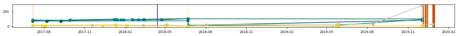</td></tr>
<tr><td><a href="http://ethyol.com/usa" target="_blank">ethyol.com/usa</a>   amifostine systemic   Cumberland Pharmaceuticals   12/08/1995</td><td>WWW2621121 </td><td><a href="https://www.ssllabs.com/ssltest/analyze.html?d=ethyol.com/usa" target="_blank">:x:</a></td><td>:x:</td><td>2.2</td><td>11</td><td><a href="https://developers.google.com/speed/pagespeed/insights/?url=ethyol.com/usa&tab=mobile" target="_blank">54</a></td><td><a href="https://developers.google.com/speed/pagespeed/insights/?url=ethyol.com/usa&tab=mobile" target="_blank">90</a></td><td><a href="https://developers.google.com/speed/pagespeed/insights/?url=ethyol.com/usa&tab=desktop" target="_blank">68</a></td><td>Apache/2.4</td><td>AS32244 Liquid Web, L.L.C</td></tr>
<tr><td colspan="11"></td></tr>
<tr><td><a href="http://lynparza.com" target="_blank">lynparza.com</a>   olaparib systemic   AstraZeneca   12/19/2014</td><td>US-1513 </td><td><a href="https://www.ssllabs.com/ssltest/analyze.html?d=lynparza.com" target="_blank">:white_check_mark:</a></td><td>:x:</td><td>3.4</td><td>571</td><td><a href="https://developers.google.com/speed/pagespeed/insights/?url=lynparza.com&tab=mobile" target="_blank">56</a></td><td><a href="https://developers.google.com/speed/pagespeed/insights/?url=lynparza.com&tab=mobile" target="_blank">100</a></td><td><a href="https://developers.google.com/speed/pagespeed/insights/?url=lynparza.com&tab=desktop" target="_blank">70</a></td><td>astrazeneca.com</td><td>None</td></tr>
<tr><td colspan="11"></td></tr>
<tr><td><a href="http://rubraca.com" target="_blank">rubraca.com</a>   rucaparib systemic   Clovis Oncology   12/19/2016</td><td>PP-RUCA-US-0622 </td><td><a href="https://www.ssllabs.com/ssltest/analyze.html?d=rubraca.com" target="_blank">:white_check_mark:</a></td><td>:x:</td><td>2.9</td><td>360</td><td><a href="https://developers.google.com/speed/pagespeed/insights/?url=rubraca.com&tab=mobile" target="_blank">8</a></td><td><a href="https://developers.google.com/speed/pagespeed/insights/?url=rubraca.com&tab=mobile" target="_blank">100</a></td><td><a href="https://developers.google.com/speed/pagespeed/insights/?url=rubraca.com&tab=desktop" target="_blank">10</a></td><td>REDACTED</td><td>AS33070 Rackspace Ltd.</td></tr>
<tr><td colspan="11"></td></tr>
<tr><td><a href="http://zejula.com" target="_blank">zejula.com</a>   niraparib systemic   GSK   03/27/2017</td><td>PP-DS-US-0460 </td><td><a href="https://www.ssllabs.com/ssltest/analyze.html?d=zejula.com" target="_blank">:white_check_mark:</a></td><td>:x:</td><td>3.0</td><td>490</td><td><a href="https://developers.google.com/speed/pagespeed/insights/?url=zejula.com&tab=mobile" target="_blank">48</a></td><td><a href="https://developers.google.com/speed/pagespeed/insights/?url=zejula.com&tab=mobile" target="_blank">99</a></td><td><a href="https://developers.google.com/speed/pagespeed/insights/?url=zejula.com&tab=desktop" target="_blank">41</a></td><td>Apache</td><td>AS15169 Google LLC</td></tr>
<tr><td colspan="11"></td></tr>
<tr><td colspan="11"><strong>Cardiovascular Conditions and Disorders - High Cholesterol</strong></td></tr>
<tr><td>Drug \ generic \ company \ FDA approval</td><td>Regulatory code </td><td>HTTPS </td><td>:man: </td><td>:trophy: </td><td>:link: </td><td>:iphone: </td><td>:wheelchair: </td><td>:computer: </td><td>Server </td><td>ASN </td></tr>
<tr><td><a href="http://crestor.com" target="_blank">crestor.com</a>   rosuvastatin systemic   AstraZeneca   08/12/2003</td><td>US-8859 </td><td><a href="https://www.ssllabs.com/ssltest/analyze.html?d=crestor.com" target="_blank">:white_check_mark:</a></td><td>:x:</td><td>4.9</td><td>27245</td><td><a href="https://developers.google.com/speed/pagespeed/insights/?url=crestor.com&tab=mobile" target="_blank">61</a></td><td><a href="https://developers.google.com/speed/pagespeed/insights/?url=crestor.com&tab=mobile" target="_blank">92</a></td><td><a href="https://developers.google.com/speed/pagespeed/insights/?url=crestor.com&tab=desktop" target="_blank">75</a></td><td>Sucuri/Cloudproxy</td><td>AS30148 Sucuri</td></tr>
<tr><td colspan="11"></td></tr>
<tr><td><a href="http://lipitor.com" target="_blank">lipitor.com</a>   atorvastatin systemic   Pfizer   12/17/1996</td><td>PP-LIP-USA-0431 </td><td><a href="https://www.ssllabs.com/ssltest/analyze.html?d=lipitor.com" target="_blank">:white_check_mark:</a></td><td>:x:</td><td>5.0</td><td>6937</td><td><a href="https://developers.google.com/speed/pagespeed/insights/?url=lipitor.com&tab=mobile" target="_blank">33</a></td><td><a href="https://developers.google.com/speed/pagespeed/insights/?url=lipitor.com&tab=mobile" target="_blank">99</a></td><td><a href="https://developers.google.com/speed/pagespeed/insights/?url=lipitor.com&tab=desktop" target="_blank">42</a></td><td>cloudflare</td><td>AS13335 Cloudflare Inc</td></tr>
<tr><td colspan="11"></td></tr>
<tr><td><a href="http://livalorx.com" target="_blank">livalorx.com</a>   pitavastatin systemic   Kowa   08/03/2009</td><td>LIV-RA-0120 </td><td><a href="https://www.ssllabs.com/ssltest/analyze.html?d=livalorx.com" target="_blank">:white_check_mark:</a></td><td>:x:</td><td>3.4</td><td>572</td><td><a href="https://developers.google.com/speed/pagespeed/insights/?url=livalorx.com&tab=mobile" target="_blank">52</a></td><td><a href="https://developers.google.com/speed/pagespeed/insights/?url=livalorx.com&tab=mobile" target="_blank">99</a></td><td><a href="https://developers.google.com/speed/pagespeed/insights/?url=livalorx.com&tab=desktop" target="_blank">60</a></td><td>nginx/1.14.0 (Ubuntu)</td><td>None</td></tr>
<tr><td colspan="11"></td></tr>
<tr><td><a href="http://repatha.com" target="_blank">repatha.com</a>   evolocumab systemic   Amgen   08/27/2015</td><td>5/22 </td><td><a href="https://www.ssllabs.com/ssltest/analyze.html?d=repatha.com" target="_blank">:white_check_mark:</a></td><td>:x:</td><td>3.9</td><td>1888</td><td><a href="https://developers.google.com/speed/pagespeed/insights/?url=repatha.com&tab=mobile" target="_blank">35</a></td><td><a href="https://developers.google.com/speed/pagespeed/insights/?url=repatha.com&tab=mobile" target="_blank">99</a></td><td><a href="https://developers.google.com/speed/pagespeed/insights/?url=repatha.com&tab=desktop" target="_blank">24</a></td><td></td><td>AS16509 Amazon.com, Inc.</td></tr>
<tr><td colspan="11"></td></tr>
<tr><td colspan="11"><strong>Central Nervous System Disorders - Alzheimer's Disease</strong></td></tr>
<tr><td>Drug \ generic \ company \ FDA approval</td><td>Regulatory code </td><td>HTTPS </td><td>:man: </td><td>:trophy: </td><td>:link: </td><td>:iphone: </td><td>:wheelchair: </td><td>:computer: </td><td>Server </td><td>ASN </td></tr>
<tr><td><a href="http://exelonpatch.com" target="_blank">exelonpatch.com</a>   rivastigmine systemic   Novartis   04/21/2000</td><td>T-EXP-1345738 </td><td><a href="https://www.ssllabs.com/ssltest/analyze.html?d=exelonpatch.com" target="_blank">:white_check_mark:</a></td><td>:x:</td><td>3.2</td><td>2226</td><td><a href="https://developers.google.com/speed/pagespeed/insights/?url=exelonpatch.com&tab=mobile" target="_blank">45</a></td><td><a href="https://developers.google.com/speed/pagespeed/insights/?url=exelonpatch.com&tab=mobile" target="_blank">95</a></td><td><a href="https://developers.google.com/speed/pagespeed/insights/?url=exelonpatch.com&tab=desktop" target="_blank">61</a></td><td></td><td>AS19551 Incapsula Inc</td></tr>
<tr><td colspan="11"></td></tr>
<tr><td><a href="http://namenda.com" target="_blank">namenda.com</a>   memantine systemic   Allergan   06/21/2010</td><td>NAM51044 </td><td><a href="https://www.ssllabs.com/ssltest/analyze.html?d=namenda.com" target="_blank">:x:</a></td><td>:x:</td><td>4.0</td><td>2045</td><td><a href="https://developers.google.com/speed/pagespeed/insights/?url=namenda.com&tab=mobile" target="_blank">66</a></td><td><a href="https://developers.google.com/speed/pagespeed/insights/?url=namenda.com&tab=mobile" target="_blank">78</a></td><td><a href="https://developers.google.com/speed/pagespeed/insights/?url=namenda.com&tab=desktop" target="_blank">71</a></td><td>Microsoft-IIS/8.5</td><td>AS16509 Amazon.com, Inc.</td></tr>
<tr><td colspan="11"></td></tr>
<tr><td><a href="http://namzaric.com" target="_blank">namzaric.com</a>   donepezil / memantine systemic   Allergan   12/23/2014</td><td>NMZ11236 </td><td><a href="https://www.ssllabs.com/ssltest/analyze.html?d=namzaric.com" target="_blank">:x:</a></td><td>:x:</td><td>3.5</td><td>1054</td><td><a href="https://developers.google.com/speed/pagespeed/insights/?url=namzaric.com&tab=mobile" target="_blank">58</a></td><td><a href="https://developers.google.com/speed/pagespeed/insights/?url=namzaric.com&tab=mobile" target="_blank">100</a></td><td><a href="https://developers.google.com/speed/pagespeed/insights/?url=namzaric.com&tab=desktop" target="_blank">66</a></td><td>Microsoft-IIS/8.5</td><td>AS16509 Amazon.com, Inc.</td></tr>
<tr><td colspan="11"></td></tr>
<tr><td colspan="11"><strong>Central Nervous System Disorders - Epilepsy</strong></td></tr>
<tr><td>Drug \ generic \ company \ FDA approval</td><td>Regulatory code </td><td>HTTPS </td><td>:man: </td><td>:trophy: </td><td>:link: </td><td>:iphone: </td><td>:wheelchair: </td><td>:computer: </td><td>Server </td><td>ASN </td></tr>
<tr><td><a href="http://depakote.com" target="_blank">depakote.com</a>   divalproex sodium systemic   AbbVie   03/10/1983</td><td>US-DPKT-190016 </td><td><a href="https://www.ssllabs.com/ssltest/analyze.html?d=depakote.com" target="_blank">:white_check_mark:</a></td><td>:x:</td><td>3.4</td><td>164</td><td><a href="https://developers.google.com/speed/pagespeed/insights/?url=depakote.com&tab=mobile" target="_blank">50</a></td><td><a href="https://developers.google.com/speed/pagespeed/insights/?url=depakote.com&tab=mobile" target="_blank">99</a></td><td><a href="https://developers.google.com/speed/pagespeed/insights/?url=depakote.com&tab=desktop" target="_blank">57</a></td><td>Microsoft-IIS/8.5</td><td>AS15395 Rackspace Ltd.</td></tr>
<tr><td colspan="11">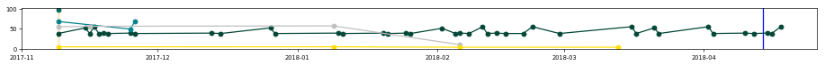</td></tr>
<tr><td><a href="http://dilantin.com" target="_blank">dilantin.com</a>   phenytoin systemic   Pfizer   03/01/1956</td><td>PP-DIL-USA-0126-01 </td><td><a href="https://www.ssllabs.com/ssltest/analyze.html?d=dilantin.com" target="_blank">:white_check_mark:</a></td><td>:x:</td><td>2.7</td><td>308</td><td><a href="https://developers.google.com/speed/pagespeed/insights/?url=dilantin.com&tab=mobile" target="_blank">35</a></td><td><a href="https://developers.google.com/speed/pagespeed/insights/?url=dilantin.com&tab=mobile" target="_blank">99</a></td><td><a href="https://developers.google.com/speed/pagespeed/insights/?url=dilantin.com&tab=desktop" target="_blank">47</a></td><td>cloudflare</td><td>AS13335 Cloudflare Inc</td></tr>
<tr><td colspan="11">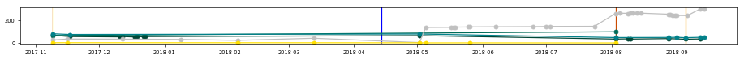</td></tr>
<tr><td><a href="http://keppraxr.com" target="_blank">keppraxr.com</a>   levetiracetam systemic   UCB   11/30/1999</td><td>USPR-KP-1214-0002 </td><td><a href="https://www.ssllabs.com/ssltest/analyze.html?d=keppraxr.com" target="_blank">:white_check_mark:</a></td><td>:x:</td><td>3.4</td><td>294</td><td><a href="https://developers.google.com/speed/pagespeed/insights/?url=keppraxr.com&tab=mobile" target="_blank">47</a></td><td><a href="https://developers.google.com/speed/pagespeed/insights/?url=keppraxr.com&tab=mobile" target="_blank">92</a></td><td><a href="https://developers.google.com/speed/pagespeed/insights/?url=keppraxr.com&tab=desktop" target="_blank">68</a></td><td>nginx</td><td>AS8075 Microsoft Corporation</td></tr>
<tr><td colspan="11">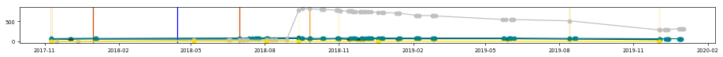</td></tr>
<tr><td><a href="http://oxtellarxr.com" target="_blank">oxtellarxr.com</a>   oxcarbazepine systemic   Supernus   10/19/2012</td><td>SPN.OXT.2019-0022 </td><td><a href="https://www.ssllabs.com/ssltest/analyze.html?d=oxtellarxr.com" target="_blank">:white_check_mark:</a></td><td>:x:</td><td>2.7</td><td>56</td><td><a href="https://developers.google.com/speed/pagespeed/insights/?url=oxtellarxr.com&tab=mobile" target="_blank">59</a></td><td><a href="https://developers.google.com/speed/pagespeed/insights/?url=oxtellarxr.com&tab=mobile" target="_blank">99</a></td><td><a href="https://developers.google.com/speed/pagespeed/insights/?url=oxtellarxr.com&tab=desktop" target="_blank">60</a></td><td>Apache/2.4.10 (Debian)</td><td>AS54098 LIONLINK NETWORKS</td></tr>
<tr><td colspan="11">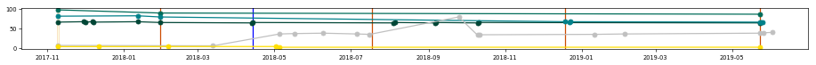</td></tr>
<tr><td colspan="11"><strong>Central Nervous System Disorders - Epilepsy - Lennox-Gastaut Syndrome; LGS</strong></td></tr>
<tr><td>Drug \ generic \ company \ FDA approval</td><td>Regulatory code </td><td>HTTPS </td><td>:man: </td><td>:trophy: </td><td>:link: </td><td>:iphone: </td><td>:wheelchair: </td><td>:computer: </td><td>Server </td><td>ASN </td></tr>
<tr><td><a href="http://banzel.com" target="_blank">banzel.com</a>   rufinamide systemic   Eisai   10/19/2012</td><td>BANZ-US2354 </td><td><a href="https://www.ssllabs.com/ssltest/analyze.html?d=banzel.com" target="_blank">:white_check_mark:</a></td><td>:x:</td><td>3.5</td><td>1583</td><td><a href="https://developers.google.com/speed/pagespeed/insights/?url=banzel.com&tab=mobile" target="_blank">85</a></td><td><a href="https://developers.google.com/speed/pagespeed/insights/?url=banzel.com&tab=mobile" target="_blank">100</a></td><td><a href="https://developers.google.com/speed/pagespeed/insights/?url=banzel.com&tab=desktop" target="_blank">87</a></td><td></td><td>AS46203 ProNet Solutions, Inc.</td></tr>
<tr><td colspan="11">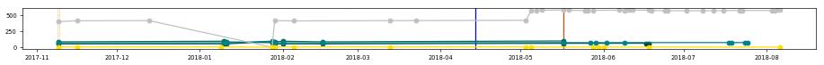</td></tr>
<tr><td><a href="http://felbatol.com" target="_blank">felbatol.com</a>   phenytoin systemic   Meda   07/29/1993</td><td>FEL6002 </td><td><a href="https://www.ssllabs.com/ssltest/analyze.html?d=felbatol.com" target="_blank">:x:</a></td><td>:x:</td><td>3.5</td><td>1583</td><td><a href="https://developers.google.com/speed/pagespeed/insights/?url=felbatol.com&tab=mobile" target="_blank">81</a></td><td><a href="https://developers.google.com/speed/pagespeed/insights/?url=felbatol.com&tab=mobile" target="_blank">66</a></td><td><a href="https://developers.google.com/speed/pagespeed/insights/?url=felbatol.com&tab=desktop" target="_blank">88</a></td><td>Microsoft-IIS/7.0</td><td>AS33070 Rackspace Ltd.</td></tr>
<tr><td colspan="11">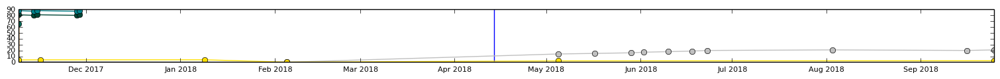</td></tr>
<tr><td><a href="http://onfi.com" target="_blank">onfi.com</a>   clobazam systemic   Lundbeck   10/19/2012</td><td>CLB-B-10024 </td><td><a href="https://www.ssllabs.com/ssltest/analyze.html?d=onfi.com" target="_blank">:x:</a></td><td>:x:</td><td>3.2</td><td>255</td><td><a href="https://developers.google.com/speed/pagespeed/insights/?url=onfi.com&tab=mobile" target="_blank">68</a></td><td><a href="https://developers.google.com/speed/pagespeed/insights/?url=onfi.com&tab=mobile" target="_blank">99</a></td><td><a href="https://developers.google.com/speed/pagespeed/insights/?url=onfi.com&tab=desktop" target="_blank">61</a></td><td>Apache</td><td>AS15533 SunGard Availability Services (UK) Ltd</td></tr>
<tr><td colspan="11">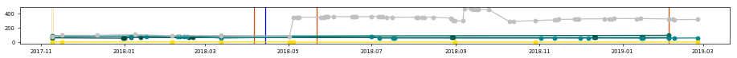</td></tr>
<tr><td colspan="11"><strong>Central Nervous System Disorders - Parkinson's Disease</strong></td></tr>
<tr><td>Drug \ generic \ company \ FDA approval</td><td>Regulatory code </td><td>HTTPS </td><td>:man: </td><td>:trophy: </td><td>:link: </td><td>:iphone: </td><td>:wheelchair: </td><td>:computer: </td><td>Server </td><td>ASN </td></tr>
<tr><td><a href="http://azilect.com" target="_blank">azilect.com</a>   rasagiline systemic   Teva   05/16/2006</td><td>AZI-41449 </td><td><a href="https://www.ssllabs.com/ssltest/analyze.html?d=azilect.com" target="_blank">:x:</a></td><td>:x:</td><td>2.7</td><td>304</td><td><a href="https://developers.google.com/speed/pagespeed/insights/?url=azilect.com&tab=mobile" target="_blank">56</a></td><td><a href="https://developers.google.com/speed/pagespeed/insights/?url=azilect.com&tab=mobile" target="_blank">99</a></td><td><a href="https://developers.google.com/speed/pagespeed/insights/?url=azilect.com&tab=desktop" target="_blank">65</a></td><td>Microsoft-IIS/8.5</td><td>AS17338 AOScloud, LLC.</td></tr>
<tr><td colspan="11"></td></tr>
<tr><td><a href="http://mirapexer.com" target="_blank">mirapexer.com</a>   pramipexole systemic   Boehringer Ingelheim   05/16/2006</td><td>not found </td><td><a href="https://www.ssllabs.com/ssltest/analyze.html?d=mirapexer.com" target="_blank">:white_check_mark:</a></td><td>:x:</td><td>4.0</td><td>921</td><td><a href="https://developers.google.com/speed/pagespeed/insights/?url=mirapexer.com&tab=mobile" target="_blank">56</a></td><td><a href="https://developers.google.com/speed/pagespeed/insights/?url=mirapexer.com&tab=mobile" target="_blank">64</a></td><td><a href="https://developers.google.com/speed/pagespeed/insights/?url=mirapexer.com&tab=desktop" target="_blank">69</a></td><td>Apache/2.4.34 (Red Hat) PHP/5.6.16 OpenSSL/1.0.1e-fips</td><td>AS14492 DataPipe, Inc.</td></tr>
<tr><td colspan="11"></td></tr>
<tr><td><a href="http://rytary.com" target="_blank">rytary.com</a>   carbidopa / levodopa systemic   Impax   07/01/2015</td><td>PP-RYT-US-0093 </td><td><a href="https://www.ssllabs.com/ssltest/analyze.html?d=rytary.com" target="_blank">:white_check_mark:</a></td><td>:x:</td><td>2.5</td><td>113</td><td><a href="https://developers.google.com/speed/pagespeed/insights/?url=rytary.com&tab=mobile" target="_blank">16</a></td><td><a href="https://developers.google.com/speed/pagespeed/insights/?url=rytary.com&tab=mobile" target="_blank">79</a></td><td><a href="https://developers.google.com/speed/pagespeed/insights/?url=rytary.com&tab=desktop" target="_blank">15</a></td><td>Sucuri/Cloudproxy</td><td>AS30148 Sucuri</td></tr>
<tr><td colspan="11"></td></tr>
<tr><td colspan="11"><strong>Connective Tissue Disorders - Rheumatoid Arthritis; RA</strong></td></tr>
<tr><td>Drug \ generic \ company \ FDA approval</td><td>Regulatory code </td><td>HTTPS </td><td>:man: </td><td>:trophy: </td><td>:link: </td><td>:iphone: </td><td>:wheelchair: </td><td>:computer: </td><td>Server </td><td>ASN </td></tr>
<tr><td><a href="http://arava.com" target="_blank">arava.com</a>   leflunomide systemic   Sanofi   09/10/1998</td><td>US.LEF.17.10.853 </td><td><a href="https://www.ssllabs.com/ssltest/analyze.html?d=arava.com" target="_blank">:x:</a></td><td>:x:</td><td>2.5</td><td>113</td><td><a href="https://developers.google.com/speed/pagespeed/insights/?url=arava.com&tab=mobile" target="_blank">76</a></td><td><a href="https://developers.google.com/speed/pagespeed/insights/?url=arava.com&tab=mobile" target="_blank">69</a></td><td><a href="https://developers.google.com/speed/pagespeed/insights/?url=arava.com&tab=desktop" target="_blank">88</a></td><td>Sanofi</td><td>AS36291 Aventis Pharmaceuticals Inc.</td></tr>
<tr><td colspan="11"></td></tr>
<tr><td><a href="http://celebrex.com" target="_blank">celebrex.com</a>   celecoxib systemic   Pfizer   12/31/1998</td><td>PP-CEL-USA-0500 </td><td><a href="https://www.ssllabs.com/ssltest/analyze.html?d=celebrex.com" target="_blank">:white_check_mark:</a></td><td>:x:</td><td>4.9</td><td>7991</td><td><a href="https://developers.google.com/speed/pagespeed/insights/?url=celebrex.com&tab=mobile" target="_blank">33</a></td><td><a href="https://developers.google.com/speed/pagespeed/insights/?url=celebrex.com&tab=mobile" target="_blank">99</a></td><td><a href="https://developers.google.com/speed/pagespeed/insights/?url=celebrex.com&tab=desktop" target="_blank">58</a></td><td>cloudflare</td><td>AS13335 Cloudflare Inc</td></tr>
<tr><td colspan="11"></td></tr>
<tr><td><a href="http://enbrel.com" target="_blank">enbrel.com</a>   etanercept systemic   Amgen   11/02/1998</td><td>not found </td><td><a href="https://www.ssllabs.com/ssltest/analyze.html?d=enbrel.com" target="_blank">:white_check_mark:</a></td><td>:x:</td><td>5</td><td>7360</td><td><a href="https://developers.google.com/speed/pagespeed/insights/?url=enbrel.com&tab=mobile" target="_blank">37</a></td><td><a href="https://developers.google.com/speed/pagespeed/insights/?url=enbrel.com&tab=mobile" target="_blank">98</a></td><td><a href="https://developers.google.com/speed/pagespeed/insights/?url=enbrel.com&tab=desktop" target="_blank">51</a></td><td>Microsoft-IIS/8.5</td><td>AS16509 Amazon.com, Inc.</td></tr>
<tr><td colspan="11"></td></tr>
<tr><td><a href="http://humira.com" target="_blank">humira.com</a>   adalimumab systemic   AbbVie   12/31/2002</td><td>US-HUM-181696 </td><td><a href="https://www.ssllabs.com/ssltest/analyze.html?d=humira.com" target="_blank">:white_check_mark:</a></td><td>:x:</td><td>5</td><td>7616</td><td><a href="https://developers.google.com/speed/pagespeed/insights/?url=humira.com&tab=mobile" target="_blank">51</a></td><td><a href="https://developers.google.com/speed/pagespeed/insights/?url=humira.com&tab=mobile" target="_blank">99</a></td><td><a href="https://developers.google.com/speed/pagespeed/insights/?url=humira.com&tab=desktop" target="_blank">74</a></td><td>Apache</td><td>AS62763 AbbVie, Inc.</td></tr>
<tr><td colspan="11"></td></tr>
<tr><td><a href="http://kevzara.com" target="_blank">kevzara.com</a>   sarilumab   Sanofi and Regeneron   05/22/2017</td><td>SAUS.SARI.17.06.4035 </td><td><a href="https://www.ssllabs.com/ssltest/analyze.html?d=kevzara.com" target="_blank">:white_check_mark:</a></td><td>:x:</td><td>3.2</td><td>329</td><td><a href="https://developers.google.com/speed/pagespeed/insights/?url=kevzara.com&tab=mobile" target="_blank">55</a></td><td><a href="https://developers.google.com/speed/pagespeed/insights/?url=kevzara.com&tab=mobile" target="_blank">99</a></td><td><a href="https://developers.google.com/speed/pagespeed/insights/?url=kevzara.com&tab=desktop" target="_blank">71</a></td><td>Microsoft-IIS/8.5</td><td>AS8075 Microsoft Corporation</td></tr>
<tr><td colspan="11"></td></tr>
<tr><td><a href="http://orencia.com" target="_blank">orencia.com</a>   adalimumab systemic   Bristol-Myers Squibb   12/23/2005</td><td>427US1800793 </td><td><a href="https://www.ssllabs.com/ssltest/analyze.html?d=orencia.com" target="_blank">:x:</a></td><td>:white_check_mark:</td><td>4.5</td><td>3836</td><td><a href="https://developers.google.com/speed/pagespeed/insights/?url=orencia.com&tab=mobile" target="_blank">56</a></td><td><a href="https://developers.google.com/speed/pagespeed/insights/?url=orencia.com&tab=mobile" target="_blank">99</a></td><td><a href="https://developers.google.com/speed/pagespeed/insights/?url=orencia.com&tab=desktop" target="_blank">74</a></td><td></td><td>AS7246 Bristol-Myers Squibb Company</td></tr>
<tr><td colspan="11">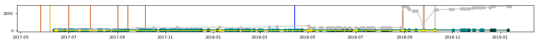</td></tr>
<tr><td><a href="http://remicade.com/rheumatoid-arthritis" target="_blank">remicade.com/rheumatoid-arthritis</a>   infliximab systemic   Janssen   08/24/1998</td><td>035714-150617 </td><td><a href="https://www.ssllabs.com/ssltest/analyze.html?d=remicade.com/rheumatoid-arthritis" target="_blank">:white_check_mark:</a></td><td>:x:</td><td>3.5</td><td>248</td><td><a href="https://developers.google.com/speed/pagespeed/insights/?url=remicade.com/rheumatoid-arthritis&tab=mobile" target="_blank">58</a></td><td><a href="https://developers.google.com/speed/pagespeed/insights/?url=remicade.com/rheumatoid-arthritis&tab=mobile" target="_blank">100</a></td><td><a href="https://developers.google.com/speed/pagespeed/insights/?url=remicade.com/rheumatoid-arthritis&tab=desktop" target="_blank">78</a></td><td>nginx</td><td>AS14618 Amazon.com, Inc.</td></tr>
<tr><td colspan="11"></td></tr>
<tr><td><a href="http://vimovo.com" target="_blank">vimovo.com</a>   esomeprazole / naproxen systemic   Horizon Pharma   04/30/2010</td><td>P-VMV-00085 </td><td><a href="https://www.ssllabs.com/ssltest/analyze.html?d=vimovo.com" target="_blank">:white_check_mark:</a></td><td>:x:</td><td>2.9</td><td>37</td><td><a href="https://developers.google.com/speed/pagespeed/insights/?url=vimovo.com&tab=mobile" target="_blank">67</a></td><td><a href="https://developers.google.com/speed/pagespeed/insights/?url=vimovo.com&tab=mobile" target="_blank">99</a></td><td><a href="https://developers.google.com/speed/pagespeed/insights/?url=vimovo.com&tab=desktop" target="_blank">73</a></td><td>Microsoft-IIS/10.0</td><td>AS8075 Microsoft Corporation</td></tr>
<tr><td colspan="11"></td></tr>
<tr><td colspan="11"><strong>Infection - Skin and Structure Infection</strong></td></tr>
<tr><td>Drug \ generic \ company \ FDA approval</td><td>Regulatory code </td><td>HTTPS </td><td>:man: </td><td>:trophy: </td><td>:link: </td><td>:iphone: </td><td>:wheelchair: </td><td>:computer: </td><td>Server </td><td>ASN </td></tr>
<tr><td><a href="http://cubicin.com" target="_blank">cubicin.com</a>   daptomycin   Merck   09/12/2003</td><td>AINF-1159022-0008 </td><td><a href="https://www.ssllabs.com/ssltest/analyze.html?d=cubicin.com" target="_blank">:white_check_mark:</a></td><td>:x:</td><td>3.4</td><td>316</td><td><a href="https://developers.google.com/speed/pagespeed/insights/?url=cubicin.com&tab=mobile" target="_blank">58</a></td><td><a href="https://developers.google.com/speed/pagespeed/insights/?url=cubicin.com&tab=mobile" target="_blank">99</a></td><td><a href="https://developers.google.com/speed/pagespeed/insights/?url=cubicin.com&tab=desktop" target="_blank">76</a></td><td>Apache/2.4.34 (Ubuntu)</td><td>AS14618 Amazon.com, Inc.</td></tr>
<tr><td colspan="11">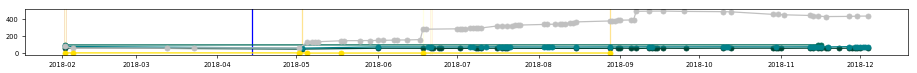</td></tr>
<tr><td><a href="http://teflaro.com" target="_blank">teflaro.com</a>   ceftaroline   Allergan   10/29/2010</td><td>TEF50891 </td><td><a href="https://www.ssllabs.com/ssltest/analyze.html?d=teflaro.com" target="_blank">:x:</a></td><td>:x:</td><td>3.5</td><td>617</td><td><a href="https://developers.google.com/speed/pagespeed/insights/?url=teflaro.com&tab=mobile" target="_blank">49</a></td><td><a href="https://developers.google.com/speed/pagespeed/insights/?url=teflaro.com&tab=mobile" target="_blank">96</a></td><td><a href="https://developers.google.com/speed/pagespeed/insights/?url=teflaro.com&tab=desktop" target="_blank">57</a></td><td></td><td>AS16509 Amazon.com, Inc.</td></tr>
<tr><td colspan="11">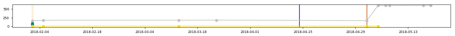</td></tr>
<tr><td colspan="11"><strong>Metabolic Disorders - Obesity</strong></td></tr>
<tr><td>Drug \ generic \ company \ FDA approval</td><td>Regulatory code </td><td>HTTPS </td><td>:man: </td><td>:trophy: </td><td>:link: </td><td>:iphone: </td><td>:wheelchair: </td><td>:computer: </td><td>Server </td><td>ASN </td></tr>
<tr><td><a href="http://belviq.com" target="_blank">belviq.com</a>   lorcaserin systemic   Eisai   06/27/2012</td><td>BELV-US2046 </td><td><a href="https://www.ssllabs.com/ssltest/analyze.html?d=belviq.com" target="_blank">:white_check_mark:</a></td><td>:x:</td><td>4.1</td><td>1973</td><td><a href="https://developers.google.com/speed/pagespeed/insights/?url=belviq.com&tab=mobile" target="_blank">60</a></td><td><a href="https://developers.google.com/speed/pagespeed/insights/?url=belviq.com&tab=mobile" target="_blank">100</a></td><td><a href="https://developers.google.com/speed/pagespeed/insights/?url=belviq.com&tab=desktop" target="_blank">78</a></td><td></td><td>AS46203 ProNet Solutions, Inc.</td></tr>
<tr><td colspan="11"></td></tr>
<tr><td><a href="http://contrave.com" target="_blank">contrave.com</a>   lbupropion / naltrexone systemic   Orexigen   09/10/2014</td><td>FDA-1088 </td><td><a href="https://www.ssllabs.com/ssltest/analyze.html?d=contrave.com" target="_blank">:white_check_mark:</a></td><td>:x:</td><td>4.0</td><td>3568</td><td><a href="https://developers.google.com/speed/pagespeed/insights/?url=contrave.com&tab=mobile" target="_blank">63</a></td><td><a href="https://developers.google.com/speed/pagespeed/insights/?url=contrave.com&tab=mobile" target="_blank">99</a></td><td><a href="https://developers.google.com/speed/pagespeed/insights/?url=contrave.com&tab=desktop" target="_blank">74</a></td><td>nginx/1.16.1</td><td>AS14618 Amazon.com, Inc.</td></tr>
<tr><td colspan="11"></td></tr>
<tr><td><a href="http://saxenda.com" target="_blank">saxenda.com</a>   liraglutide systemic   Novo Nordisk   12/23/2014</td><td>USA17SAM02705 </td><td><a href="https://www.ssllabs.com/ssltest/analyze.html?d=saxenda.com" target="_blank">:x:</a></td><td>:white_check_mark:</td><td>3.9</td><td>737</td><td><a href="https://developers.google.com/speed/pagespeed/insights/?url=saxenda.com&tab=mobile" target="_blank">50</a></td><td><a href="https://developers.google.com/speed/pagespeed/insights/?url=saxenda.com&tab=mobile" target="_blank">99</a></td><td><a href="https://developers.google.com/speed/pagespeed/insights/?url=saxenda.com&tab=desktop" target="_blank">72</a></td><td>Apache/2.4.29 (Red Hat) OpenSSL/1.0.2k-fips Communique/4.2.2</td><td>AS33070 Rackspace Ltd.</td></tr>
<tr><td colspan="11"></td></tr>
<tr><td><a href="http://qsymia.com" target="_blank">qsymia.com</a>   phentermine / topiramate systemic   Vivus   07/17/2012</td><td>100028.47 </td><td><a href="https://www.ssllabs.com/ssltest/analyze.html?d=qsymia.com" target="_blank">:white_check_mark:</a></td><td>:x:</td><td>4.1</td><td>4532</td><td><a href="https://developers.google.com/speed/pagespeed/insights/?url=qsymia.com&tab=mobile" target="_blank">66</a></td><td><a href="https://developers.google.com/speed/pagespeed/insights/?url=qsymia.com&tab=mobile" target="_blank">98</a></td><td><a href="https://developers.google.com/speed/pagespeed/insights/?url=qsymia.com&tab=desktop" target="_blank">80</a></td><td>Apache</td><td>AS32244 Liquid Web, L.L.C</td></tr>
<tr><td colspan="11"></td></tr>
<tr><td colspan="11"><strong>Psychiatric Disorders - Depression - Major Depressive Disorder; MDD</strong></td></tr>
<tr><td>Drug \ generic \ company \ FDA approval</td><td>Regulatory code </td><td>HTTPS </td><td>:man: </td><td>:trophy: </td><td>:link: </td><td>:iphone: </td><td>:wheelchair: </td><td>:computer: </td><td>Server </td><td>ASN </td></tr>
<tr><td><a href="http://abilify.com" target="_blank">abilify.com</a>   aripiprazole systemic   Otsuka   11/15/2002</td><td>03US18EBC0023 </td><td><a href="https://www.ssllabs.com/ssltest/analyze.html?d=abilify.com" target="_blank">:white_check_mark:</a></td><td>:x:</td><td>4.9</td><td>5871</td><td><a href="https://developers.google.com/speed/pagespeed/insights/?url=abilify.com&tab=mobile" target="_blank">68</a></td><td><a href="https://developers.google.com/speed/pagespeed/insights/?url=abilify.com&tab=mobile" target="_blank">99</a></td><td><a href="https://developers.google.com/speed/pagespeed/insights/?url=abilify.com&tab=desktop" target="_blank">82</a></td><td>cloudflare</td><td>AS13335 Cloudflare Inc</td></tr>
<tr><td colspan="11">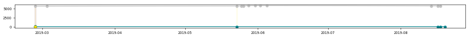</td></tr>
<tr><td><a href="http://fetzima.com" target="_blank">fetzima.com</a>   levomilnacipran systemic   Allergan   07/25/2013</td><td>FTZ72370 </td><td><a href="https://www.ssllabs.com/ssltest/analyze.html?d=fetzima.com" target="_blank">:x:</a></td><td>:x:</td><td>3.7</td><td>571</td><td><a href="https://developers.google.com/speed/pagespeed/insights/?url=fetzima.com&tab=mobile" target="_blank">55</a></td><td><a href="https://developers.google.com/speed/pagespeed/insights/?url=fetzima.com&tab=mobile" target="_blank">99</a></td><td><a href="https://developers.google.com/speed/pagespeed/insights/?url=fetzima.com&tab=desktop" target="_blank">73</a></td><td></td><td>AS16509 Amazon.com, Inc.</td></tr>
<tr><td colspan="11">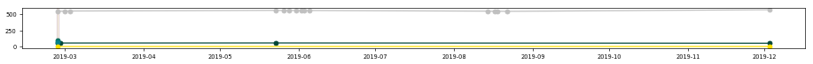</td></tr>
<tr><td><a href="http://rexulti.com" target="_blank">rexulti.com</a>   brexpiprazole systemic   Otsuka   07/10/2015</td><td>11US19EBC0058 </td><td><a href="https://www.ssllabs.com/ssltest/analyze.html?d=rexulti.com" target="_blank">:white_check_mark:</a></td><td>:x:</td><td>3.2</td><td>275</td><td><a href="https://developers.google.com/speed/pagespeed/insights/?url=rexulti.com&tab=mobile" target="_blank">62</a></td><td><a href="https://developers.google.com/speed/pagespeed/insights/?url=rexulti.com&tab=mobile" target="_blank">99</a></td><td><a href="https://developers.google.com/speed/pagespeed/insights/?url=rexulti.com&tab=desktop" target="_blank">82</a></td><td>cloudflare</td><td>AS13335 Cloudflare Inc</td></tr>
<tr><td colspan="11">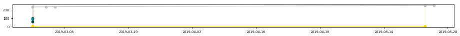</td></tr>
<tr><td><a href="http://trintellix.com" target="_blank">trintellix.com</a>   vortioxetine systemic   Takeda   09/30/2013</td><td>not found </td><td><a href="https://www.ssllabs.com/ssltest/analyze.html?d=trintellix.com" target="_blank">:x:</a></td><td>:x:</td><td>1.7</td><td>0</td><td><a href="https://developers.google.com/speed/pagespeed/insights/?url=trintellix.com&tab=mobile" target="_blank">53</a></td><td><a href="https://developers.google.com/speed/pagespeed/insights/?url=trintellix.com&tab=mobile" target="_blank">96</a></td><td><a href="https://developers.google.com/speed/pagespeed/insights/?url=trintellix.com&tab=desktop" target="_blank">71</a></td><td>Apache</td><td>AS15533 SunGard Availability Services (UK) Ltd</td></tr>
<tr><td colspan="11">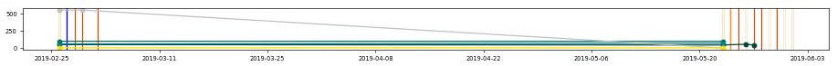</td></tr>
<tr><td colspan="11"><strong>Respiratory Tract Disease - Chronic Obstructive Pulmonary Disease; COPD</strong></td></tr>
<tr><td>Drug \ generic \ company \ FDA approval</td><td>Regulatory code </td><td>HTTPS </td><td>:man: </td><td>:trophy: </td><td>:link: </td><td>:iphone: </td><td>:wheelchair: </td><td>:computer: </td><td>Server </td><td>ASN </td></tr>
<tr><td><a href="http://bevespi.com" target="_blank">bevespi.com</a>   formoterol / glycopyrrolate   AstraZeneca   04/25/2016</td><td>US-1014 </td><td><a href="https://www.ssllabs.com/ssltest/analyze.html?d=bevespi.com" target="_blank">:white_check_mark:</a></td><td>:x:</td><td>3</td><td>121</td><td><a href="https://developers.google.com/speed/pagespeed/insights/?url=bevespi.com&tab=mobile" target="_blank">40</a></td><td><a href="https://developers.google.com/speed/pagespeed/insights/?url=bevespi.com&tab=mobile" target="_blank">98</a></td><td><a href="https://developers.google.com/speed/pagespeed/insights/?url=bevespi.com&tab=desktop" target="_blank">65</a></td><td>Sucuri/Cloudproxy</td><td>AS30148 Sucuri</td></tr>
<tr><td colspan="11"></td></tr>
<tr><td><a href="http://daliresp.com" target="_blank">daliresp.com</a>   roflumilast systemic   AstraZeneca   02/28/2011</td><td>US-19965 </td><td><a href="https://www.ssllabs.com/ssltest/analyze.html?d=daliresp.com" target="_blank">:white_check_mark:</a></td><td>:x:</td><td>3.0</td><td>301</td><td><a href="https://developers.google.com/speed/pagespeed/insights/?url=daliresp.com&tab=mobile" target="_blank">59</a></td><td><a href="https://developers.google.com/speed/pagespeed/insights/?url=daliresp.com&tab=mobile" target="_blank">97</a></td><td><a href="https://developers.google.com/speed/pagespeed/insights/?url=daliresp.com&tab=desktop" target="_blank">70</a></td><td>Sucuri/Cloudproxy</td><td>AS30148 Sucuri</td></tr>
<tr><td colspan="11"></td></tr>
<tr><td><a href="http://mysymbicort.com" target="_blank">mysymbicort.com</a>   budesonide / formoterol   AstraZeneca   07/21/2006</td><td>US-1872 </td><td><a href="https://www.ssllabs.com/ssltest/analyze.html?d=mysymbicort.com" target="_blank">:white_check_mark:</a></td><td>:x:</td><td>4.8</td><td>7398</td><td><a href="https://developers.google.com/speed/pagespeed/insights/?url=mysymbicort.com&tab=mobile" target="_blank">64</a></td><td><a href="https://developers.google.com/speed/pagespeed/insights/?url=mysymbicort.com&tab=mobile" target="_blank">95</a></td><td><a href="https://developers.google.com/speed/pagespeed/insights/?url=mysymbicort.com&tab=desktop" target="_blank">83</a></td><td>astrazeneca.com Communique/4.3.2</td><td>None</td></tr>
<tr><td colspan="11"></td></tr>
<tr><td><a href="http://anoro.com" target="_blank">anoro.com</a>   umeclidinium / vilanterol   GSK   12/18/2013</td><td>UCVWCNT190017 </td><td><a href="https://www.ssllabs.com/ssltest/analyze.html?d=anoro.com" target="_blank">:white_check_mark:</a></td><td>:x:</td><td>3.2</td><td>519</td><td><a href="https://developers.google.com/speed/pagespeed/insights/?url=anoro.com&tab=mobile" target="_blank">25</a></td><td><a href="https://developers.google.com/speed/pagespeed/insights/?url=anoro.com&tab=mobile" target="_blank">98</a></td><td><a href="https://developers.google.com/speed/pagespeed/insights/?url=anoro.com&tab=desktop" target="_blank">31</a></td><td>Apache</td><td>AS14618 Amazon.com, Inc.</td></tr>
<tr><td colspan="11">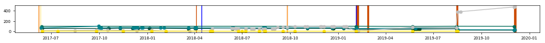</td></tr>
<tr><td colspan="11"><strong>Respiratory Tract Disease - Pleuropulmonary Infection - Pneumonia; CABP</strong></td></tr>
<tr><td>Drug \ generic \ company \ FDA approval</td><td>Regulatory code </td><td>HTTPS </td><td>:man: </td><td>:trophy: </td><td>:link: </td><td>:iphone: </td><td>:wheelchair: </td><td>:computer: </td><td>Server </td><td>ASN </td></tr>
<tr><td><a href="http://avycaz.com" target="_blank">avycaz.com</a>   avibactam and ceftazidime   Allergan   02/25/2015</td><td>AVY109174-v4 </td><td><a href="https://www.ssllabs.com/ssltest/analyze.html?d=avycaz.com" target="_blank">:x:</a></td><td>:x:</td><td>3.7</td><td>843</td><td><a href="https://developers.google.com/speed/pagespeed/insights/?url=avycaz.com&tab=mobile" target="_blank">61</a></td><td><a href="https://developers.google.com/speed/pagespeed/insights/?url=avycaz.com&tab=mobile" target="_blank">97</a></td><td><a href="https://developers.google.com/speed/pagespeed/insights/?url=avycaz.com&tab=desktop" target="_blank">74</a></td><td></td><td>AS16509 Amazon.com, Inc.</td></tr>
<tr><td colspan="11">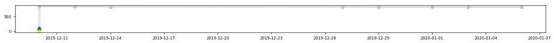</td></tr>
<tr><td><a href="http://baxdela.com" target="_blank">baxdela.com</a>   delafloxacin   Melinta   06/19/2017</td><td>PP-BAX-US-0399 </td><td><a href="https://www.ssllabs.com/ssltest/analyze.html?d=baxdela.com" target="_blank">:white_check_mark:</a></td><td>:x:</td><td>2</td><td>98</td><td><a href="https://developers.google.com/speed/pagespeed/insights/?url=baxdela.com&tab=mobile" target="_blank">38</a></td><td><a href="https://developers.google.com/speed/pagespeed/insights/?url=baxdela.com&tab=mobile" target="_blank">92</a></td><td><a href="https://developers.google.com/speed/pagespeed/insights/?url=baxdela.com&tab=desktop" target="_blank">42</a></td><td>Apache</td><td>AS26347 New Dream Network, LLC</td></tr>
<tr><td colspan="11">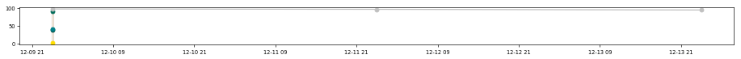</td></tr>
<tr><td><a href="http://nuzyra.com" target="_blank">nuzyra.com</a>   omadacycline   Paratek   10/02/2018</td><td>US-NUA-0167 06/19 </td><td><a href="https://www.ssllabs.com/ssltest/analyze.html?d=nuzyra.com" target="_blank">:white_check_mark:</a></td><td>:x:</td><td>1.7</td><td>333</td><td><a href="https://developers.google.com/speed/pagespeed/insights/?url=nuzyra.com&tab=mobile" target="_blank">39</a></td><td><a href="https://developers.google.com/speed/pagespeed/insights/?url=nuzyra.com&tab=mobile" target="_blank">91</a></td><td><a href="https://developers.google.com/speed/pagespeed/insights/?url=nuzyra.com&tab=desktop" target="_blank">55</a></td><td>Apache</td><td>AS27357 Rackspace Ltd.</td></tr>
<tr><td colspan="11">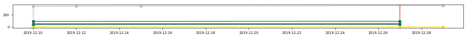</td></tr>
<tr><td><a href="http://xenleta.com" target="_blank">xenleta.com</a>   lefamulin   Nabriva   08/19/2019</td><td>PM-US-LEF-0077 </td><td><a href="https://www.ssllabs.com/ssltest/analyze.html?d=xenleta.com" target="_blank">:white_check_mark:</a></td><td>:x:</td><td>1</td><td>15</td><td><a href="https://developers.google.com/speed/pagespeed/insights/?url=xenleta.com&tab=mobile" target="_blank">50</a></td><td><a href="https://developers.google.com/speed/pagespeed/insights/?url=xenleta.com&tab=mobile" target="_blank">99</a></td><td><a href="https://developers.google.com/speed/pagespeed/insights/?url=xenleta.com&tab=desktop" target="_blank">74</a></td><td>Apache</td><td>AS8075 Microsoft Corporation</td></tr>
<tr><td colspan="11">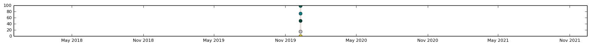</td></tr>
<tr><td colspan="11"><strong>Respiratory Tract Disease - Pulmonary Arterial Hypertension; PAH</strong></td></tr>
<tr><td>Drug \ generic \ company \ FDA approval</td><td>Regulatory code </td><td>HTTPS </td><td>:man: </td><td>:trophy: </td><td>:link: </td><td>:iphone: </td><td>:wheelchair: </td><td>:computer: </td><td>Server </td><td>ASN </td></tr>
<tr><td><a href="http://4ventavis.com" target="_blank">4ventavis.com</a>   iloprost systemic   Actelion   12/29/2004</td><td>VEN-00242 </td><td><a href="https://www.ssllabs.com/ssltest/analyze.html?d=4ventavis.com" target="_blank">:white_check_mark:</a></td><td>:x:</td><td>2.7</td><td>16</td><td><a href="https://developers.google.com/speed/pagespeed/insights/?url=4ventavis.com&tab=mobile" target="_blank">54</a></td><td><a href="https://developers.google.com/speed/pagespeed/insights/?url=4ventavis.com&tab=mobile" target="_blank">70</a></td><td><a href="https://developers.google.com/speed/pagespeed/insights/?url=4ventavis.com&tab=desktop" target="_blank">66</a></td><td>AmazonS3</td><td>None</td></tr>
<tr><td colspan="11"></td></tr>
<tr><td><a href="http://adcirca.com" target="_blank">adcirca.com</a>   tadalafil systemic   United Therapeutics   05/22/2009</td><td>US/ADC/0120 </td><td><a href="https://www.ssllabs.com/ssltest/analyze.html?d=adcirca.com" target="_blank">:white_check_mark:</a></td><td>:x:</td><td>2.5</td><td>122</td><td><a href="https://developers.google.com/speed/pagespeed/insights/?url=adcirca.com&tab=mobile" target="_blank">62</a></td><td><a href="https://developers.google.com/speed/pagespeed/insights/?url=adcirca.com&tab=mobile" target="_blank">66</a></td><td><a href="https://developers.google.com/speed/pagespeed/insights/?url=adcirca.com&tab=desktop" target="_blank">77</a></td><td>Microsoft-IIS/10.0</td><td>AS19551 Incapsula Inc</td></tr>
<tr><td colspan="11"></td></tr>
<tr><td><a href="http://adempas-us.com" target="_blank">adempas-us.com</a>   riociguat   Bayer   10/08/2013</td><td>12/2019 </td><td><a href="https://www.ssllabs.com/ssltest/analyze.html?d=adempas-us.com" target="_blank">:white_check_mark:</a></td><td>:x:</td><td>2.9</td><td>356</td><td><a href="https://developers.google.com/speed/pagespeed/insights/?url=adempas-us.com&tab=mobile" target="_blank">60</a></td><td><a href="https://developers.google.com/speed/pagespeed/insights/?url=adempas-us.com&tab=mobile" target="_blank">88</a></td><td><a href="https://developers.google.com/speed/pagespeed/insights/?url=adempas-us.com&tab=desktop" target="_blank">82</a></td><td>nginx</td><td>AS16673 Bayer Corporation</td></tr>
<tr><td colspan="11"></td></tr>
<tr><td><a href="http://letairis.com" target="_blank">letairis.com</a>   ambrisentan systemic   Gilead   06/15/2007</td><td>LETC0320 </td><td><a href="https://www.ssllabs.com/ssltest/analyze.html?d=letairis.com" target="_blank">:white_check_mark:</a></td><td>:x:</td><td>2.9</td><td>460</td><td><a href="https://developers.google.com/speed/pagespeed/insights/?url=letairis.com&tab=mobile" target="_blank">54</a></td><td><a href="https://developers.google.com/speed/pagespeed/insights/?url=letairis.com&tab=mobile" target="_blank">99</a></td><td><a href="https://developers.google.com/speed/pagespeed/insights/?url=letairis.com&tab=desktop" target="_blank">71</a></td><td>Microsoft-IIS/8.5</td><td>AS27357 Rackspace Ltd.</td></tr>
<tr><td colspan="11"></td></tr>
<tr><td><a href="http://opsumit.com" target="_blank">opsumit.com</a>   macitentan systemic   Actelion   10/18/2013</td><td>FDA-10881 </td><td><a href="https://www.ssllabs.com/ssltest/analyze.html?d=opsumit.com" target="_blank">:white_check_mark:</a></td><td>:x:</td><td>3.2</td><td>324</td><td><a href="https://developers.google.com/speed/pagespeed/insights/?url=opsumit.com&tab=mobile" target="_blank">41</a></td><td><a href="https://developers.google.com/speed/pagespeed/insights/?url=opsumit.com&tab=mobile" target="_blank">100</a></td><td><a href="https://developers.google.com/speed/pagespeed/insights/?url=opsumit.com&tab=desktop" target="_blank">51</a></td><td>AmazonS3</td><td>AS16509 Amazon.com, Inc.</td></tr>
<tr><td colspan="11"></td></tr>
<tr><td><a href="http://orenitram.com" target="_blank">orenitram.com</a>   treprostinil systemic   United Therapeutics   12/20/2013</td><td>US/ORE/0356 </td><td><a href="https://www.ssllabs.com/ssltest/analyze.html?d=orenitram.com" target="_blank">:white_check_mark:</a></td><td>:white_check_mark:</td><td>2.9</td><td>193</td><td><a href="https://developers.google.com/speed/pagespeed/insights/?url=orenitram.com&tab=mobile" target="_blank">54</a></td><td><a href="https://developers.google.com/speed/pagespeed/insights/?url=orenitram.com&tab=mobile" target="_blank">94</a></td><td><a href="https://developers.google.com/speed/pagespeed/insights/?url=orenitram.com&tab=desktop" target="_blank">62</a></td><td>Apache</td><td>AS19551 Incapsula Inc</td></tr>
<tr><td colspan="11"></td></tr>
<tr><td><a href="http://remodulin.com" target="_blank">remodulin.com</a>   treprostinil systemic   United Therapeutics   07/05/2001</td><td>US/REM/0271 </td><td><a href="https://www.ssllabs.com/ssltest/analyze.html?d=remodulin.com" target="_blank">:white_check_mark:</a></td><td>:white_check_mark:</td><td>3.5</td><td>537</td><td><a href="https://developers.google.com/speed/pagespeed/insights/?url=remodulin.com&tab=mobile" target="_blank">71</a></td><td><a href="https://developers.google.com/speed/pagespeed/insights/?url=remodulin.com&tab=mobile" target="_blank">97</a></td><td><a href="https://developers.google.com/speed/pagespeed/insights/?url=remodulin.com&tab=desktop" target="_blank">85</a></td><td>Microsoft-IIS/10.0</td><td>AS19551 Incapsula Inc</td></tr>
<tr><td colspan="11"></td></tr>
<tr><td><a href="http://revatio.com" target="_blank">revatio.com</a>   sildenafil systemic   Pfizer   06/03/2005</td><td>PP-REV-USA-0132 </td><td><a href="https://www.ssllabs.com/ssltest/analyze.html?d=revatio.com" target="_blank">:white_check_mark:</a></td><td>:x:</td><td>3.5</td><td>433</td><td><a href="https://developers.google.com/speed/pagespeed/insights/?url=revatio.com&tab=mobile" target="_blank">37</a></td><td><a href="https://developers.google.com/speed/pagespeed/insights/?url=revatio.com&tab=mobile" target="_blank">99</a></td><td><a href="https://developers.google.com/speed/pagespeed/insights/?url=revatio.com&tab=desktop" target="_blank">45</a></td><td>cloudflare</td><td>AS13335 Cloudflare Inc</td></tr>
<tr><td colspan="11"></td></tr>
<tr><td><a href="http://tracleer.com" target="_blank">tracleer.com</a>   bosentan systemic   Actelion   11/20/2001</td><td>TRA-00483 </td><td><a href="https://www.ssllabs.com/ssltest/analyze.html?d=tracleer.com" target="_blank">:white_check_mark:</a></td><td>:x:</td><td>2.9</td><td>179</td><td><a href="https://developers.google.com/speed/pagespeed/insights/?url=tracleer.com&tab=mobile" target="_blank">58</a></td><td><a href="https://developers.google.com/speed/pagespeed/insights/?url=tracleer.com&tab=mobile" target="_blank">67</a></td><td><a href="https://developers.google.com/speed/pagespeed/insights/?url=tracleer.com&tab=desktop" target="_blank">66</a></td><td>AmazonS3</td><td>None</td></tr>
<tr><td colspan="11"></td></tr>
<tr><td><a href="http://tyvaso.com" target="_blank">tyvaso.com</a>   treprostinil systemic   United Therapeutics   07/30/2009</td><td>US/TYV/0250 </td><td><a href="https://www.ssllabs.com/ssltest/analyze.html?d=tyvaso.com" target="_blank">:white_check_mark:</a></td><td>:white_check_mark:</td><td>2.5</td><td>269</td><td><a href="https://developers.google.com/speed/pagespeed/insights/?url=tyvaso.com&tab=mobile" target="_blank">38</a></td><td><a href="https://developers.google.com/speed/pagespeed/insights/?url=tyvaso.com&tab=mobile" target="_blank">97</a></td><td><a href="https://developers.google.com/speed/pagespeed/insights/?url=tyvaso.com&tab=desktop" target="_blank">58</a></td><td>Apache/2.4.29 (Ubuntu)</td><td>AS19551 Incapsula Inc</td></tr>
<tr><td colspan="11"></td></tr>
<tr><td><a href="http://uptravi.com" target="_blank">uptravi.com</a>   selexipag systemic   Actelion   12/21/2015</td><td>not found </td><td><a href="https://www.ssllabs.com/ssltest/analyze.html?d=uptravi.com" target="_blank">:white_check_mark:</a></td><td>:x:</td><td>2.2</td><td>102</td><td><a href="https://developers.google.com/speed/pagespeed/insights/?url=uptravi.com&tab=mobile" target="_blank">28</a></td><td><a href="https://developers.google.com/speed/pagespeed/insights/?url=uptravi.com&tab=mobile" target="_blank">88</a></td><td><a href="https://developers.google.com/speed/pagespeed/insights/?url=uptravi.com&tab=desktop" target="_blank">33</a></td><td>AmazonS3</td><td>None</td></tr>
<tr><td colspan="11"></td></tr>
<tr><td><a href="http://veletri.com" target="_blank">veletri.com</a>   epoprostenol systemic   Actelion   06/27/2008</td><td>VEL-00287 </td><td><a href="https://www.ssllabs.com/ssltest/analyze.html?d=veletri.com" target="_blank">:white_check_mark:</a></td><td>:x:</td><td>2.7</td><td>170</td><td><a href="https://developers.google.com/speed/pagespeed/insights/?url=veletri.com&tab=mobile" target="_blank">53</a></td><td><a href="https://developers.google.com/speed/pagespeed/insights/?url=veletri.com&tab=mobile" target="_blank">61</a></td><td><a href="https://developers.google.com/speed/pagespeed/insights/?url=veletri.com&tab=desktop" target="_blank">66</a></td><td>AmazonS3</td><td>None</td></tr>
<tr><td colspan="11"></td></tr>
<tr><td colspan="11"><strong>Viral Infection - Human Immunodeficiency Virus Infection; HIV</strong></td></tr>
<tr><td>Drug \ generic \ company \ FDA approval</td><td>Regulatory code </td><td>HTTPS </td><td>:man: </td><td>:trophy: </td><td>:link: </td><td>:iphone: </td><td>:wheelchair: </td><td>:computer: </td><td>Server </td><td>ASN </td></tr>
<tr><td><a href="http://atripla.com" target="_blank">atripla.com</a>   favirenz / emtricitabine / tenofovir systemic   Gilead   07/12/2006</td><td>ATRC0137 </td><td><a href="https://www.ssllabs.com/ssltest/analyze.html?d=atripla.com" target="_blank">:white_check_mark:</a></td><td>:x:</td><td>3.5</td><td>93</td><td><a href="https://developers.google.com/speed/pagespeed/insights/?url=atripla.com&tab=mobile" target="_blank">70</a></td><td><a href="https://developers.google.com/speed/pagespeed/insights/?url=atripla.com&tab=mobile" target="_blank">100</a></td><td><a href="https://developers.google.com/speed/pagespeed/insights/?url=atripla.com&tab=desktop" target="_blank">78</a></td><td>Microsoft-IIS/8.5</td><td>AS33070 Rackspace Ltd.</td></tr>
<tr><td colspan="11"></td></tr>
<tr><td><a href="http://isentress.com" target="_blank">isentress.com</a>   raltegravir systemic   Merck   10/12/2007</td><td>INFC-1242705-0007 </td><td><a href="https://www.ssllabs.com/ssltest/analyze.html?d=isentress.com" target="_blank">:white_check_mark:</a></td><td>:x:</td><td>3.5</td><td>423</td><td><a href="https://developers.google.com/speed/pagespeed/insights/?url=isentress.com&tab=mobile" target="_blank">59</a></td><td><a href="https://developers.google.com/speed/pagespeed/insights/?url=isentress.com&tab=mobile" target="_blank">95</a></td><td><a href="https://developers.google.com/speed/pagespeed/insights/?url=isentress.com&tab=desktop" target="_blank">66</a></td><td>Apache/2.4.34 (Ubuntu)</td><td>AS14618 Amazon.com, Inc.</td></tr>
<tr><td colspan="11"></td></tr>
<tr><td><a href="http://norvir.com" target="_blank">norvir.com</a>   ritonavir systemic   AbbVie   03/01/1996</td><td>US-NORV-190007 </td><td><a href="https://www.ssllabs.com/ssltest/analyze.html?d=norvir.com" target="_blank">:white_check_mark:</a></td><td>:x:</td><td>2.9</td><td>69</td><td><a href="https://developers.google.com/speed/pagespeed/insights/?url=norvir.com&tab=mobile" target="_blank">62</a></td><td><a href="https://developers.google.com/speed/pagespeed/insights/?url=norvir.com&tab=mobile" target="_blank">96</a></td><td><a href="https://developers.google.com/speed/pagespeed/insights/?url=norvir.com&tab=desktop" target="_blank">74</a></td><td>Microsoft-IIS/8.5</td><td>AS15395 Rackspace Ltd.</td></tr>
<tr><td colspan="11"></td></tr>
<tr><td><a href="http://prezcobix.com" target="_blank">prezcobix.com</a>   darunavir systemic   Janssen   01/29/2015</td><td>cp-33793 </td><td><a href="https://www.ssllabs.com/ssltest/analyze.html?d=prezcobix.com" target="_blank">:white_check_mark:</a></td><td>:x:</td><td>2.2</td><td>149</td><td><a href="https://developers.google.com/speed/pagespeed/insights/?url=prezcobix.com&tab=mobile" target="_blank">48</a></td><td><a href="https://developers.google.com/speed/pagespeed/insights/?url=prezcobix.com&tab=mobile" target="_blank">100</a></td><td><a href="https://developers.google.com/speed/pagespeed/insights/?url=prezcobix.com&tab=desktop" target="_blank">71</a></td><td>nginx</td><td>AS14618 Amazon.com, Inc.</td></tr>
<tr><td colspan="11"></td></tr>
<tr><td><a href="http://start.truvada.com" target="_blank">start.truvada.com</a>   emtricitabine / tenofovir systemic   Gilead   08/02/2004</td><td>TVDC0347 </td><td><a href="https://www.ssllabs.com/ssltest/analyze.html?d=start.truvada.com" target="_blank">:white_check_mark:</a></td><td>:x:</td><td>5.0</td><td>6239</td><td><a href="https://developers.google.com/speed/pagespeed/insights/?url=start.truvada.com&tab=mobile" target="_blank">42</a></td><td><a href="https://developers.google.com/speed/pagespeed/insights/?url=start.truvada.com&tab=mobile" target="_blank">95</a></td><td><a href="https://developers.google.com/speed/pagespeed/insights/?url=start.truvada.com&tab=desktop" target="_blank">61</a></td><td>Microsoft-IIS/8.5</td><td>AS19994 Rackspace Ltd.</td></tr>
<tr><td colspan="11"></td></tr>
</table>
